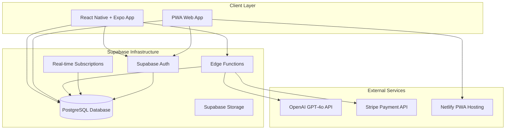
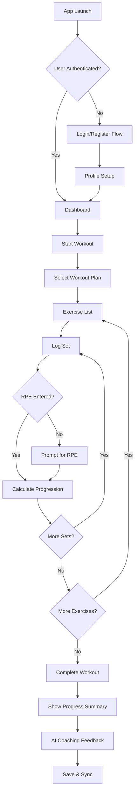
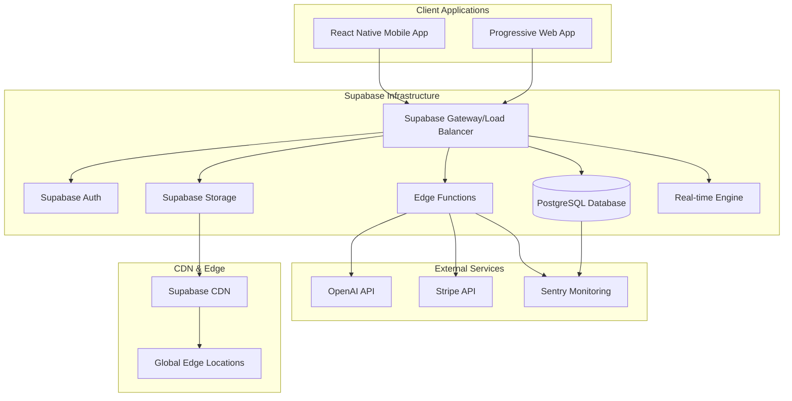

# TrainSmart Technical Specification

## 1. Executive Summary

### Project Overview and Objectives

TrainSmart is an AI-powered mobile workout tracking application that bridges the gap between generic fitness tracking and personalized coaching. The platform transforms how lifters approach their training journey by combining automated progression algorithms with intelligent AI coaching, providing smart progression suggestions based on RPE (Rate of Perceived Exertion) methodology and personalized AI feedback that adapts to each user's experience level and goals[^1].

**Core Value Proposition:** "The only workout app that actually coaches you through progression"

**Target Market:** Beginner to early-intermediate lifters (3 months - 18 months experience), ages 18-40, seeking structured guidance and systematic progression in their training.

### Key Technical Decisions and Rationale

**Architecture Decision: Supabase-First Approach**

- **PostgreSQL Database**: Leverages Supabase's managed PostgreSQL for structured fitness data with JSONB support for flexible schema requirements[^2][^3]
- **Edge Functions**: Supabase Edge Functions provide serverless Node.js environment for AI integration, progression engine, and business rules[^4][^5]
- **Built-in Authentication**: Supabase Auth eliminates need for separate identity management while integrating seamlessly with database[^2]

**Frontend Decision: React Native + Expo**

- **Cross-Platform Development**: Single codebase for iOS, Android, and PWA deployment[^2][^6]
- **Rapid Development**: Expo's managed workflow accelerates development without native complexity[^6][^7]
- **PWA Capability**: Automatic PWA generation enables desktop browser access[^2]

**State Management: Redux Toolkit**

- **Predictable State Updates**: Essential for workout tracking with time-travel debugging capabilities[^8][^9]
- **Complex State Logic**: Handles offline synchronization, progression algorithms, and AI coaching state[^9][^10]

### High-Level Architecture



### Technology Stack Recommendations

**Frontend \& Mobile**

- **Platform**: React Native 0.79.5 with Expo SDK 53.0.20[^2]
- **Navigation**: React Navigation v6 for tab and stack navigation[^2]
- **State Management**: Redux Toolkit for predictable state updates[^8][^9]
- **Offline Storage**: React Native AsyncStorage + Expo SecureStore[^2]
- **UI Framework**: Custom design system based on provided specifications

**Backend \& Database**

- **Backend Framework**: Supabase Edge Functions (Node.js/TypeScript)[^4][^5][^11]
- **Database**: PostgreSQL hosted by Supabase[^2][^3]
- **Authentication**: Supabase Auth with role-based access control[^2]
- **Real-time**: Supabase Real-time subscriptions[^2]

**External Integrations**

- **AI Processing**: OpenAI GPT-4o API with cost optimization[^12][^13]
- **Payments**: Stripe API for subscription management[^14][^15]
- **PWA Hosting**: Netlify for web deployment[^2]

**Development \& Operations**

- **Build System**: EAS Build for cloud-based compilation[^2]
- **Testing**: Detox for end-to-end testing[^2]
- **Monitoring**: Sentry for error tracking and performance[^2]
- **Analytics**: Google Analytics for user behavior insights[^2]
- **Code Storage**: GitHub

## 2. System Architecture

### 2.1 Architecture Overview

TrainSmart employs a modern serverless architecture built entirely on Supabase infrastructure, providing scalability, cost-effectiveness, and reduced operational complexity.

**Core Architecture Principles:**

1. **Serverless-First**: All backend logic runs on Supabase Edge Functions[^4][^5]
2. **Offline-First**: Mobile app functions completely offline with background synchronization[^1]
3. **Real-time**: Live updates for coaching, progress tracking, and collaborative features[^2]
4. **Cost-Optimized**: AI usage controls maintain \$1/month per user ceiling[^12][^13]

**System Components:**

```typescript
interface SystemArchitecture {
  presentation: {
    mobileApp: "React Native + Expo";
    webApp: "PWA via Expo Web";
    designSystem: "Custom Component Library";
  };
  businessLogic: {
    authentication: "Supabase Auth";
    workoutEngine: "Progression Algorithm Service";
    aiCoaching: "OpenAI Integration Service";
    subscriptions: "Stripe Integration Service";
  };
  dataLayer: {
    database: "Supabase PostgreSQL";
    storage: "Supabase Storage";
    cache: "Redis via Supabase";
    offline: "AsyncStorage + SecureStore";
  };
  infrastructure: {
    backend: "Supabase Edge Functions";
    realTime: "Supabase Real-time";
    cdn: "Supabase CDN";
    monitoring: "Sentry + Supabase Logs";
  };
}
```

**Data Flow Architecture:**

1. **User Interaction**: React Native app captures workout data, user inputs, AI queries
2. **Local Processing**: Immediate UI updates with optimistic updates stored locally
3. **Background Sync**: Automatic synchronization when connectivity available
4. **Edge Processing**: AI requests, progression calculations via Edge Functions
5. **Real-time Updates**: Live progress updates, coaching notifications via WebSockets

### 2.2 Technology Stack

**Frontend Technologies**

- **React Native 0.79.5**: Cross-platform mobile development with New Architecture support[^2][^16]
- **Expo SDK 53.0.20**: Managed development workflow with native capabilities[^2][^7]
- **Redux Toolkit**: State management with RTK Query for API calls[^8][^9]
- **React Navigation 6**: Tab and stack navigation with deep linking[^2]
- **React Native Reanimated 3.17.4**: Smooth animations for workout interfaces[^2]
- **React Hook Form**: Form state management and validation with proper focus handling and performance optimization

**Backend Technologies**

- **Supabase Edge Functions**: Serverless TypeScript functions with Deno runtime[^4][^5][^11]
- **Node.js Compatibility**: Full npm module support for existing libraries[^11]
- **TypeScript**: Type-safe development across frontend and backend[^4]

**Database Solutions**

- **PostgreSQL 15+**: Primary database via Supabase with JSONB support[^2][^3]
- **Row Level Security**: Built-in security policies for user data isolation[^2]
- **Real-time Subscriptions**: Live data updates via WebSocket connections[^2]

**Third-Party Services**

- **OpenAI GPT-4o**: AI coaching with cost optimization strategies[^12][^13]
- **Stripe**: Payment processing and subscription management[^14][^15]
- **Sentry**: Error tracking and performance monitoring[^2]

### 2.3 Technology Rules

## **React Native rules**

description: This rule explains React Native component patterns and mobile-specific considerations.
globs: **/\*.jsx,**/\*.tsx
alwaysApply: false

---

- Use functional components with hooks
- Follow a consistent folder structure (components, screens, navigation, services, hooks, utils)
- Use React Navigation for screen navigation
- Use StyleSheet for styling instead of inline styles
- Use FlatList for rendering lists instead of map + ScrollView
- Use custom hooks for reusable logic
- Implement proper error boundaries and loading states
- Optimize images and assets for mobile performance

### **Performance Optimizations**

**Avoid Unnecessary Memoization**:

- Don't use `useMemo` for simple property access (e.g., `errors.email`)
- Don't use `useCallback` for handlers that depend on frequently changing values
- Don't use custom `React.memo` comparison functions unless absolutely necessary

**Error Handling Pattern**:

```typescript
// ✅ CORRECT - Simple error state management
const [errors, setErrors] = useState<{ email?: string }>({});

const handleEmailChange = (value: string) => {
  if (errors.email) {
    setErrors((prev) => ({ ...prev, error: undefined }));
  }
};

// ❌ INCORRECT - Over-memoized error handling
const emailError = useMemo(() => errors.email, [errors.email]);
const handleEmailChange = useCallback(
  (value: string) => {
    if (errors.email) {
      setErrors((prev) => ({ ...prev, email: undefined }));
    }
  },
  [errors.email]
);
```

## **Code Simplicity Guidelines**

description: TrainSmart follows strict simplicity principles to prevent over-engineering and maintain code quality.
globs: **/\*.jsx,**/\*.tsx,\*\*/\*.ts
alwaysApply: true

---

### **Anti-Patterns to Avoid**

**❌ Over-Memoization**:

```typescript
// DON'T - Unnecessary memoization of simple transformations
const loading = useMemo(
  () => ({
    login: globalLoading,
    signup: globalLoading,
  }),
  [globalLoading]
);

// DO - Simple object transformation
const loading = {
  login: globalLoading,
  signup: globalLoading,
};
```

**❌ Excessive useCallback**:

```typescript
// DON'T - Wrapping every function in useCallback
const handleClick = useCallback(() => {
  console.log("clicked");
}, []);

// DO - Only use useCallback when actually needed for performance
const handleClick = () => {
  console.log("clicked");
};
```

**❌ Complex Form Validation Hooks**:

```typescript
// DON'T - Over-engineered form hooks with debouncing, interaction counting, etc.
const { values, errors, formState, handleChange, handleBlur, validateField } = useFormValidation(
  schema,
  initialValues,
  {
    validateOnChange: true,
    validateOnBlur: true,
    debounceMs: 300,
    interactionCount: true,
    touchedFields: true,
  }
);

// DO - Simple error state with refs
const [errors, setErrors] = useState<{ email?: string }>({});
const emailFieldRef = useRef<FormFieldRef>(null);
```

**❌ Singleton Service Classes**:

```typescript
// DON'T - Complex singleton patterns
export class AuthService {
  private static instance: AuthService;
  private constructor() {}
  public static getInstance(): AuthService {
    if (!AuthService.instance) {
      AuthService.instance = new AuthService();
    }
    return AuthService.instance;
  }
}

// DO - Simple module exports
export async function signIn(credentials: LoginCredentials): Promise<AuthResponse> {
  // Implementation
}
export const authService = { signIn, signOut, signUp };
```

### **Simplicity Principles**

1. **Prefer Simple Functions Over Classes**: Use module exports instead of singleton classes
2. **Avoid Premature Optimization**: Don't memoize unless there's a proven performance issue
3. **Keep State Management Simple**: Use basic useState for most cases, avoid complex state machines
4. **Let Libraries Handle Complexity**: Use Supabase's built-in features (autoRefreshToken) instead of manual implementations
5. **Eliminate Unused Abstractions**: Remove hooks/utilities that aren't actually needed

### **Service Architecture**

**✅ Simplified Service Pattern**:

```typescript
// Simple function exports
export async function signUp(data: SignupData): Promise<AuthResponse> {
  // Direct implementation without class overhead
}

export async function signIn(credentials: LoginCredentials): Promise<AuthResponse> {
  // Direct implementation
}

// Backward compatibility object
export const authService = {
  signUp,
  signIn,
  signOut,
  // ... other functions
};
```

### **Hook Simplification Rules**

1. **Remove useMemo for Simple Transformations**: Object creation, property access, simple calculations
2. **Remove useCallback for Non-Performance-Critical Functions**: Event handlers that don't cause child re-renders
3. **Simplify Dependency Arrays**: Only include dependencies that actually matter for correctness
4. **Avoid Custom Hooks for Simple Logic**: If it's just useState + useEffect, keep it inline

### **Input Handling: Direct TextInput with Style Constants**

**CRITICAL: iOS Keyboard Focus Issues**

Due to iOS keyboard focus issues with wrapper components, TrainSmart uses **direct TextInput components** with centralized style constants instead of wrapper components.

**✅ Correct Direct TextInput Pattern**:

```typescript
// Import style constants
import {
  getInputStyle,
  getInputState,
  getInputProps,
  LABEL_STYLES,
  ERROR_STYLES,
  FIELD_STYLES,
} from "@/styles/inputStyles";

// Component with focus state management
const [focusedField, setFocusedField] = useState<string | null>(null);
const [errors, setErrors] = useState<{ email?: string }>({});

// Direct TextInput usage
<View style={FIELD_STYLES.container}>
  <Text style={LABEL_STYLES.base}>Email Address *</Text>
  <TextInput
    style={getInputStyle(undefined, getInputState(focusedField === "email", !!errors.email))}
    value={email}
    onChangeText={setEmail}
    onFocus={() => setFocusedField("email")}
    onBlur={() => setFocusedField(null)}
    {...getInputProps("email")}
    placeholder='Enter your email'
  />
  {errors.email && <Text style={ERROR_STYLES.text}>{errors.email}</Text>}
</View>;
```

**Style Constants System**:

```typescript
// Centralized input styling in src/styles/inputStyles.ts
export const INPUT_STYLES = {
  base: { /* base TextInput styles */ },
  states: {
    default: { /* default border/background */ },
    focused: { /* focus styles with shadow */ },
    error: { /* error state styling */ },
    success: { /* success state styling */ }
  },
  variants: {
    search: { /* search field styles */ },
    rpe: { /* RPE input styles */ },
    textarea: { /* large text area styles */ }
  }
};

// Helper functions
export const getInputStyle = (variant?, state?) => [/* combined styles */];
export const getInputState = (isFocused, hasError) => /* state key */;
export const getInputProps = (type) => /* common TextInput props */;
```

**Form Integration with React Hook Form**:

For forms requiring validation, combine direct TextInput with React Hook Form:

```typescript
// Form setup
const {
  control,
  handleSubmit,
  formState: { errors },
} = useForm({
  resolver: zodResolver(validationSchema),
  mode: "onSubmit",
  reValidateMode: "onChange",
});

// Direct TextInput with react-hook-form Controller
<Controller
  name='email'
  control={control}
  render={({ field: { onChange, onBlur, value }, fieldState: { error, isTouched } }) => (
    <View style={FIELD_STYLES.container}>
      <Text style={LABEL_STYLES.base}>Email Address *</Text>
      <TextInput
        style={getInputStyle(undefined, getInputState(focusedField === "email", !!error))}
        value={value}
        onChangeText={onChange}
        onFocus={() => setFocusedField("email")}
        onBlur={() => {
          setFocusedField(null);
          onBlur();
        }}
        {...getInputProps("email")}
        placeholder='Enter your email'
      />
      {isTouched && error && <Text style={ERROR_STYLES.text}>{error.message}</Text>}
    </View>
  )}
/>;
```

**❌ Avoid These Patterns**:

- Wrapper Input components (causes iOS keyboard focus issues)
- Complex component hierarchies around TextInput
- Custom Input components with Controller integration
- Removing onFocus/onBlur handlers (breaks focus state management)

**Benefits of Direct TextInput Approach**:

- ✅ **Reliable iOS keyboard behavior** - No focus issues
- ✅ **Consistent styling** - Centralized style constants
- ✅ **Simple debugging** - Clear component hierarchy
- ✅ **Performance optimized** - No unnecessary wrapper renders
- ✅ **Easy to customize** - Direct access to TextInput props

### **Performance Guidelines**

1. **Measure Before Optimizing**: Don't add memoization without profiling first
2. **Trust React's Performance**: Modern React is fast, avoid premature optimization
3. **Focus on User Experience**: Eliminate keyboard issues and UI lag over micro-optimizations
4. **Leverage Platform Features**: Use Supabase's built-in optimizations instead of custom solutions

### **Code Review Checklist**

- [ ] Are there unnecessary useMemo/useCallback wrappers?
- [ ] Can complex hooks be simplified or removed?
- [ ] Are we using uncontrolled inputs for forms?
- [ ] Can singleton classes be converted to simple modules?
- [ ] Are we letting libraries handle their own complexity?
- [ ] Is the code easy to understand and debug?

## 3. Feature Specifications

### 3.1 User Authentication \& Profile Management

**User Stories:**

- As a new user, I want to create an account with email verification so I can securely access the app
- As a user, I want to set up my fitness profile so the app can provide personalized recommendations
- As a user, I want to manage my privacy settings so I control how my data is used

**Technical Requirements:**

- Supabase Auth integration with email/password authentication[^2]
- Progressive profile setup with experience level detection
- CCPA/PIPEDA compliance with granular privacy controls[^1]
- Secure token storage using Expo SecureStore[^2]

**Implementation Approach:**

```typescript
// Authentication Service
export class AuthService {
  private supabase = createClient(SUPABASE_URL, SUPABASE_ANON_KEY);

  async signUp(email: string, password: string, profile: UserProfile): Promise<AuthResponse> {
    const { data, error } = await this.supabase.auth.signUp({
      email,
      password,
      options: {
        data: {
          display_name: profile.displayName,
          experience_level: profile.experienceLevel,
        },
      },
    });

    if (data.user) {
      await this.createUserProfile(data.user.id, profile);
    }

    return { data, error };
  }

  async createUserProfile(userId: string, profile: UserProfile): Promise<void> {
    const { error } = await this.supabase.from("user_profiles").insert({
      id: userId,
      ...profile,
      created_at: new Date().toISOString(),
    });
  }
}
```

**Data Models:**

```sql
-- User Profiles Table
CREATE TABLE user_profiles (
  id UUID PRIMARY KEY REFERENCES auth.users(id),
  display_name TEXT NOT NULL,
  height_cm INTEGER,
  weight_kg DECIMAL(5,2),
  experience_level experience_level_enum NOT NULL,
  fitness_goals TEXT[],
  privacy_settings JSONB DEFAULT '{"data_sharing": false, "analytics": true}',
  created_at TIMESTAMP WITH TIME ZONE DEFAULT NOW(),
  updated_at TIMESTAMP WITH TIME ZONE DEFAULT NOW()
);

-- Row Level Security
ALTER TABLE user_profiles ENABLE ROW LEVEL SECURITY;

CREATE POLICY "Users can view own profile" ON user_profiles
  FOR SELECT USING (auth.uid() = id);

CREATE POLICY "Users can update own profile" ON user_profiles
  FOR UPDATE USING (auth.uid() = id);
```

**Error Handling:**

- Network connectivity failures with offline queueing
- Invalid credentials with user-friendly messaging
- Profile validation errors with field-specific feedback

**Performance Considerations:**

- Profile image compression and CDN delivery via Supabase Storage
- Lazy loading of extended profile data
- Caching user preferences locally

### 3.2 Workout Tracking System

**User Stories:**

- As a user, I want to log my workouts offline so I can track progress without internet
- As a user, I want the app to suggest when to increase weight based on my RPE ratings
- As a user, I want to see my progress over time so I can stay motivated

**Technical Requirements:**

- Offline-first architecture with background synchronization[^1]
- RPE-based progression algorithm for experience-appropriate recommendations[^1]
- Real-time sync conflict resolution
- Progressive overload automation based on user experience level[^1]

**Implementation Approach:**

**Offline Storage Service:**

```typescript
export class OfflineWorkoutService {
  private storage = AsyncStorage;

  async saveWorkoutOffline(workout: WorkoutSession): Promise<void> {
    const offlineWorkouts = await this.getOfflineWorkouts();
    const updatedWorkouts = [
      ...offlineWorkouts,
      {
        ...workout,
        syncStatus: "pending",
        offlineTimestamp: Date.now(),
      },
    ];

    await this.storage.setItem("@offline_workouts", JSON.stringify(updatedWorkouts));
  }

  async syncPendingWorkouts(): Promise<void> {
    const offlineWorkouts = await this.getOfflineWorkouts();
    const pendingWorkouts = offlineWorkouts.filter((w) => w.syncStatus === "pending");

    for (const workout of pendingWorkouts) {
      try {
        await this.supabase.from("workout_sessions").upsert(workout, { onConflict: "id" });

        await this.markWorkoutSynced(workout.id);
      } catch (error) {
        await this.markWorkoutConflicted(workout.id, error);
      }
    }
  }
}
```

**Progression Algorithm:**

```typescript
export class ProgressionService {
  calculateProgression(user: UserProfile, exercise: Exercise, recentSets: Set[]): ProgressionRecommendation {
    const { experienceLevel } = user;
    const averageRPE = this.calculateAverageRPE(recentSets);

    switch (experienceLevel) {
      case "untrained":
        return this.untrainedProgression(exercise, recentSets);
      case "beginner":
        return this.beginnerProgression(exercise, recentSets, averageRPE);
      case "early_intermediate":
        return this.rpeBasedProgression(exercise, recentSets, averageRPE);
      default:
        return this.conservativeProgression(exercise, recentSets);
    }
  }

  private rpeBasedProgression(exercise: Exercise, sets: Set[], avgRPE: number): ProgressionRecommendation {
    const targetRPE = 8; // Target RPE for main working sets
    const rpeThreshold = 1; // Must drop 1 RPE point to progress

    if (avgRPE <= targetRPE - rpeThreshold) {
      return {
        shouldProgress: true,
        recommendedIncrease: this.calculateWeightIncrease(exercise.category),
        reason: `RPE dropped to ${avgRPE}, ready for weight increase`,
      };
    }

    return {
      shouldProgress: false,
      reason: `Current RPE ${avgRPE} - maintain current weight until RPE ≤ ${targetRPE - rpeThreshold}`,
    };
  }
}
```

**Database Schema:**

```sql
-- Workout Sessions
CREATE TABLE workout_sessions (
  id UUID PRIMARY KEY DEFAULT gen_random_uuid(),
  user_id UUID NOT NULL REFERENCES user_profiles(id),
  plan_id UUID REFERENCES workout_plans(id),
  started_at TIMESTAMP WITH TIME ZONE NOT NULL,
  completed_at TIMESTAMP WITH TIME ZONE,
  duration_minutes INTEGER,
  notes TEXT,
  sync_status sync_status_enum DEFAULT 'synced',
  created_at TIMESTAMP WITH TIME ZONE DEFAULT NOW()
);

-- Exercise Sets
CREATE TABLE exercise_sets (
  id UUID PRIMARY KEY DEFAULT gen_random_uuid(),
  session_id UUID NOT NULL REFERENCES workout_sessions(id) ON DELETE CASCADE,
  exercise_id UUID NOT NULL REFERENCES exercises(id),
  set_number INTEGER NOT NULL,
  weight_kg DECIMAL(6,2),
  reps INTEGER,
  rpe INTEGER CHECK (rpe >= 1 AND rpe <= 10),
  is_warmup BOOLEAN DEFAULT FALSE,
  rest_seconds INTEGER,
  notes TEXT,
  created_at TIMESTAMP WITH TIME ZONE DEFAULT NOW()
);

-- Indexes for performance
CREATE INDEX idx_workout_sessions_user_date ON workout_sessions(user_id, started_at DESC);
CREATE INDEX idx_exercise_sets_session ON exercise_sets(session_id);
CREATE INDEX idx_exercise_sets_exercise_user ON exercise_sets(exercise_id, session_id)
  WHERE is_warmup = FALSE;
```

**API Endpoints:**

```typescript
// Edge Function: workout-sync
import { createClient } from "@supabase/supabase-js";

export default async function handler(req: Request): Promise<Response> {
  if (req.method !== "POST") {
    return new Response("Method not allowed", { status: 405 });
  }

  const { workouts, userId } = await req.json();
  const supabase = createClient(Deno.env.get("SUPABASE_URL")!, Deno.env.get("SUPABASE_SERVICE_ROLE_KEY")!);

  const results = [];

  for (const workout of workouts) {
    try {
      // Check for conflicts
      const { data: existingWorkout } = await supabase
        .from("workout_sessions")
        .select("updated_at")
        .eq("id", workout.id)
        .single();

      if (existingWorkout && new Date(existingWorkout.updated_at) > new Date(workout.updated_at)) {
        results.push({
          id: workout.id,
          status: "conflict",
          serverVersion: existingWorkout,
        });
        continue;
      }

      // Upsert workout
      const { error } = await supabase.from("workout_sessions").upsert(workout, { onConflict: "id" });

      results.push({
        id: workout.id,
        status: error ? "error" : "synced",
        error: error?.message,
      });
    } catch (error) {
      results.push({
        id: workout.id,
        status: "error",
        error: error.message,
      });
    }
  }

  return new Response(JSON.stringify({ results }), {
    headers: { "Content-Type": "application/json" },
  });
}
```

### 3.3 AI Coaching System

**User Stories:**

- As a premium user, I want AI coaching feedback so I can improve my form and progression
- As a user, I want monthly progress reviews so I can understand my development
- As a user, I want cost-effective AI usage so the service remains affordable

**Technical Requirements:**

- OpenAI GPT-4o integration with cost optimization (\$1/month per user limit)[^12][^13]
- Context-aware responses based on user's workout history[^1]
- Token optimization and model selection strategies[^17][^13]
- Automated monthly review generation[^1]

**Cost Management Implementation:**

```typescript
// Edge Function: ai-coach
export class AICoachService {
  private openai: OpenAI;
  private maxMonthlySpend = 1.00; // $1 per user per month

  async processQuery(userId: string, query: string): Promise<AIResponse> {
    // Check usage limits
    const usage = await this.getUserUsage(userId);
    if (usage.monthlySpent >= this.maxMonthlySpend) {
      return this.generateFallbackResponse('usage_limit_exceeded');
    }

    // Optimize query and context
    const context = await this.buildOptimizedContext(userId, query);
    const optimizedPrompt = this.optimizePrompt(query, context);

    // Select appropriate model
    const model = this.selectModel(query);
    const estimatedCost = this.estimateRequestCost(optimizedPrompt, model);

    if (usage.monthlySpent + estimatedCost > this.maxMonthlySpend) {
      return this.generateFallbackResponse('approaching_limit');
    }

    try {
      const response = await this.openai.chat.completions.create({
        model,
        messages: [
          { role: 'system', content: this.getSystemPrompt() },
          { role: 'user', content: optimizedPrompt }
        ],
        max_tokens: 500, // Cost control
        temperature: 0.7
      });

      // Track usage
      await this.trackUsage(userId, response.usage?.total_tokens || 0, estimatedCost);

      return {
        response: response.choices[^0].message.content,
        tokensUsed: response.usage?.total_tokens || 0,
        cost: estimatedCost
      };
    } catch (error) {
      return this.generateFallbackResponse('api_error', error);
    }
  }

  private optimizePrompt(query: string, context: AIContext): string {
    // Remove unnecessary whitespace and optimize JSON structure[^27]
    const compactContext = JSON.stringify(context).replace(/\s+/g, ' ');
    return `Context: ${compactContext}\n\nQuery: ${query.trim()}`;
  }

  private selectModel(query: string): string {
    // Use cheaper models for simple queries[^30]
    const simpleQueryPatterns = [
      /how many sets/i,
      /what weight/i,
      /rest time/i,
      /form check/i
    ];

    const isSimpleQuery = simpleQueryPatterns.some(pattern => pattern.test(query));
    return isSimpleQuery ? 'gpt-3.5-turbo' : 'gpt-4o-mini';
  }
}
```

**Monthly Review System:**

```typescript
// Edge Function: generate-monthly-review
export default async function handler(req: Request): Promise<Response> {
  const { userId } = await req.json();

  // Gather user data for review
  const userData = await gatherUserData(userId);

  const reviewPrompt = `
    Generate a comprehensive monthly fitness review for user ${userId}.
    
    Workout Data (last 30 days):
    - Total workouts: ${userData.workoutCount}
    - Total volume: ${userData.totalVolume}kg
    - Average RPE: ${userData.averageRPE}
    - Missed sessions: ${userData.missedSessions}
    
    Progress Metrics:
    - Strength gains: ${JSON.stringify(userData.strengthGains)}
    - Body weight change: ${userData.weightChange}kg
    - Goal achievement: ${userData.goalProgress}%
    
    Provide:
    1. Progress summary (2-3 sentences)
    2. Key achievements (bullet points)
    3. Areas for improvement (2-3 points)
    4. Next month recommendations (3-4 specific actions)
    
    Keep response under 400 words, encouraging tone.
  `;

  // Process with cost optimization
  const aiService = new AICoachService();
  const review = await aiService.processQuery(userId, reviewPrompt);

  // Save review to database
  await saveMonthlyReview(userId, review);

  return new Response(JSON.stringify(review), {
    headers: { "Content-Type": "application/json" },
  });
}
```

**Usage Tracking Schema:**

```sql
-- AI Usage Tracking
CREATE TABLE ai_usage_tracking (
  id UUID PRIMARY KEY DEFAULT gen_random_uuid(),
  user_id UUID NOT NULL REFERENCES user_profiles(id),
  query_type TEXT NOT NULL,
  tokens_used INTEGER NOT NULL,
  estimated_cost DECIMAL(8,6) NOT NULL,
  model_used TEXT NOT NULL,
  response_time_ms INTEGER,
  created_at TIMESTAMP WITH TIME ZONE DEFAULT NOW()
);

-- Monthly usage view
CREATE VIEW monthly_ai_usage AS
SELECT
  user_id,
  DATE_TRUNC('month', created_at) as month,
  SUM(tokens_used) as total_tokens,
  SUM(estimated_cost) as total_cost,
  COUNT(*) as total_queries
FROM ai_usage_tracking
GROUP BY user_id, DATE_TRUNC('month', created_at);
```

### 3.4 Subscription Management

**User Stories:**

- As a user, I want to upgrade to premium so I can access AI coaching features
- As a user, I want secure payment processing so my financial data is protected
- As a coach, I want to manage client subscriptions so I can provide value-added services

**Technical Requirements:**

- Stripe integration for secure payment processing[^14][^15][^18]
- Tiered subscription plans (Free, Premium \$9.99/month, Coach \$29.99/month)[^1]
- Automated subscription state management with webhooks[^1]
- Revenue analytics and churn prevention[^1]

**Payment Processing Implementation:**

```typescript
// Edge Function: create-payment-intent
export default async function handler(req: Request): Promise<Response> {
  const { planId, userId } = await req.json();
  const supabase = createSupabaseClient();

  // Get user and plan details
  const { data: user } = await supabase.from("user_profiles").select("*").eq("id", userId).single();

  const { data: plan } = await supabase.from("subscription_plans").select("*").eq("id", planId).single();

  // Create or retrieve Stripe customer
  let stripeCustomerId = user.stripe_customer_id;
  if (!stripeCustomerId) {
    const customer = await stripe.customers.create({
      email: user.email,
      metadata: { user_id: userId },
    });

    stripeCustomerId = customer.id;
    await supabase.from("user_profiles").update({ stripe_customer_id: stripeCustomerId }).eq("id", userId);
  }

  // Create subscription
  const subscription = await stripe.subscriptions.create({
    customer: stripeCustomerId,
    items: [{ price: plan.stripe_price_id }],
    payment_behavior: "default_incomplete",
    payment_settings: { save_default_payment_method: "on_subscription" },
    expand: ["latest_invoice.payment_intent"],
  });

  return new Response(
    JSON.stringify({
      subscriptionId: subscription.id,
      clientSecret: subscription.latest_invoice.payment_intent.client_secret,
    }),
    {
      headers: { "Content-Type": "application/json" },
    }
  );
}
```

**Stripe Webhook Handler:**

```typescript
// Edge Function: stripe-webhook
export default async function handler(req: Request): Promise<Response> {
  const signature = req.headers.get("stripe-signature");
  const body = await req.text();

  let event: Stripe.Event;
  try {
    event = stripe.webhooks.constructEvent(body, signature, webhookSecret);
  } catch (err) {
    console.error("Webhook signature verification failed:", err);
    return new Response("Invalid signature", { status: 400 });
  }

  const supabase = createSupabaseClient();

  switch (event.type) {
    case "subscription.created":
      await handleSubscriptionCreated(event.data.object, supabase);
      break;
    case "subscription.updated":
      await handleSubscriptionUpdated(event.data.object, supabase);
      break;
    case "subscription.deleted":
      await handleSubscriptionDeleted(event.data.object, supabase);
      break;
    case "payment_intent.payment_failed":
      await handlePaymentFailed(event.data.object, supabase);
      break;
  }

  return new Response(JSON.stringify({ received: true }), {
    headers: { "Content-Type": "application/json" },
  });
}

async function handleSubscriptionCreated(subscription: Stripe.Subscription, supabase: any) {
  const customerId = subscription.customer as string;

  // Get user from Stripe customer ID
  const { data: user } = await supabase
    .from("user_profiles")
    .select("id")
    .eq("stripe_customer_id", customerId)
    .single();

  // Create subscription record
  await supabase.from("subscriptions").insert({
    user_id: user.id,
    stripe_subscription_id: subscription.id,
    stripe_customer_id: customerId,
    status: subscription.status,
    current_period_start: new Date(subscription.current_period_start * 1000),
    current_period_end: new Date(subscription.current_period_end * 1000),
  });

  // Update user role based on subscription
  const plan = await getPlanFromStripeSubscription(subscription);
  await updateUserRole(user.id, plan.role);
}
```

**Subscription Schema:**

```sql
-- Subscription Plans
CREATE TABLE subscription_plans (
  id UUID PRIMARY KEY DEFAULT gen_random_uuid(),
  name TEXT NOT NULL,
  description TEXT,
  price_cents INTEGER NOT NULL,
  interval subscription_interval_enum NOT NULL,
  stripe_price_id TEXT UNIQUE NOT NULL,
  features JSONB NOT NULL DEFAULT '[]',
  is_active BOOLEAN DEFAULT TRUE,
  created_at TIMESTAMP WITH TIME ZONE DEFAULT NOW()
);

-- User Subscriptions
CREATE TABLE subscriptions (
  id UUID PRIMARY KEY DEFAULT gen_random_uuid(),
  user_id UUID NOT NULL REFERENCES user_profiles(id),
  plan_id UUID REFERENCES subscription_plans(id),
  stripe_subscription_id TEXT UNIQUE NOT NULL,
  stripe_customer_id TEXT NOT NULL,
  status subscription_status_enum NOT NULL,
  current_period_start TIMESTAMP WITH TIME ZONE NOT NULL,
  current_period_end TIMESTAMP WITH TIME ZONE NOT NULL,
  trial_start TIMESTAMP WITH TIME ZONE,
  trial_end TIMESTAMP WITH TIME ZONE,
  canceled_at TIMESTAMP WITH TIME ZONE,
  created_at TIMESTAMP WITH TIME ZONE DEFAULT NOW(),
  updated_at TIMESTAMP WITH TIME ZONE DEFAULT NOW()
);

-- Revenue Analytics View
CREATE VIEW subscription_analytics AS
SELECT
  DATE_TRUNC('month', current_period_start) as month,
  sp.name as plan_name,
  COUNT(*) as subscriber_count,
  SUM(sp.price_cents / 100.0) as monthly_revenue,
  AVG(sp.price_cents / 100.0) as avg_revenue_per_user
FROM subscriptions s
JOIN subscription_plans sp ON s.plan_id = sp.id
WHERE s.status = 'active'
GROUP BY DATE_TRUNC('month', current_period_start), sp.name, sp.price_cents;
```

## 4. Data Architecture

### 4.1 Data Models

**User Management Entities:**

```sql
-- User Profiles (extends Supabase Auth)
CREATE TYPE experience_level_enum AS ENUM ('untrained', 'beginner', 'early_intermediate', 'intermediate');
CREATE TYPE gender_enum AS ENUM ('male', 'female', 'other', 'prefer_not_to_say');

CREATE TABLE user_profiles (
  id UUID PRIMARY KEY REFERENCES auth.users(id) ON DELETE CASCADE,
  display_name TEXT NOT NULL,
  email TEXT NOT NULL,
  avatar_url TEXT,
  height_cm INTEGER CHECK (height_cm > 0 AND height_cm < 300),
  weight_kg DECIMAL(5,2) CHECK (weight_kg > 0 AND weight_kg < 1000),
  birth_date DATE,
  gender gender_enum,
  experience_level experience_level_enum NOT NULL DEFAULT 'untrained',
  fitness_goals TEXT[] DEFAULT '{}',
  available_equipment TEXT[] DEFAULT '{}',
  privacy_settings JSONB DEFAULT '{"data_sharing": false, "analytics": true, "ai_coaching": true}',
  stripe_customer_id TEXT,
  created_at TIMESTAMP WITH TIME ZONE DEFAULT NOW(),
  updated_at TIMESTAMP WITH TIME ZONE DEFAULT NOW()
);

-- Indexes for performance
CREATE INDEX idx_user_profiles_experience ON user_profiles(experience_level);
CREATE INDEX idx_user_profiles_stripe ON user_profiles(stripe_customer_id) WHERE stripe_customer_id IS NOT NULL;
```

**Workout System Entities:**

```sql
-- Exercise Database
CREATE TYPE muscle_group_enum AS ENUM (
  'chest', 'back', 'shoulders', 'biceps', 'triceps', 'forearms',
  'quadriceps', 'hamstrings', 'glutes', 'calves', 'abs', 'core'
);

CREATE TYPE equipment_enum AS ENUM (
  'barbell', 'dumbbell', 'kettlebell', 'cable', 'machine',
  'bodyweight', 'resistance_band', 'plate'
);

CREATE TABLE exercises (
  id UUID PRIMARY KEY DEFAULT gen_random_uuid(),
  name TEXT NOT NULL,
  description TEXT,
  instructions JSONB, -- Step-by-step instructions
  muscle_groups muscle_group_enum[] NOT NULL,
  primary_muscle muscle_group_enum NOT NULL,
  equipment equipment_enum[] NOT NULL,
  difficulty INTEGER CHECK (difficulty >= 1 AND difficulty <= 5) DEFAULT 2,
  is_compound BOOLEAN DEFAULT FALSE,
  alternatives UUID[], -- References to alternative exercises
  demo_video_url TEXT,
  created_at TIMESTAMP WITH TIME ZONE DEFAULT NOW(),
  updated_at TIMESTAMP WITH TIME ZONE DEFAULT NOW()
);

-- Workout Plans
CREATE TYPE plan_type_enum AS ENUM ('full_body', 'upper_lower', 'body_part_split', 'custom');

CREATE TABLE workout_plans (
  id UUID PRIMARY KEY DEFAULT gen_random_uuid(),
  name TEXT NOT NULL,
  description TEXT,
  type plan_type_enum NOT NULL,
  frequency_per_week INTEGER CHECK (frequency_per_week >= 1 AND frequency_per_week <= 7),
  duration_weeks INTEGER CHECK (duration_weeks > 0),
  difficulty INTEGER CHECK (difficulty >= 1 AND difficulty <= 5),
  target_experience experience_level_enum[] NOT NULL,
  created_by UUID REFERENCES user_profiles(id),
  is_template BOOLEAN DEFAULT FALSE,
  is_public BOOLEAN DEFAULT FALSE,
  tags TEXT[] DEFAULT '{}',
  created_at TIMESTAMP WITH TIME ZONE DEFAULT NOW(),
  updated_at TIMESTAMP WITH TIME ZONE DEFAULT NOW()
);

-- Workout Plan Sessions (individual workouts within a plan)
CREATE TABLE workout_plan_sessions (
  id UUID PRIMARY KEY DEFAULT gen_random_uuid(),
  plan_id UUID NOT NULL REFERENCES workout_plans(id) ON DELETE CASCADE,
  name TEXT NOT NULL,
  day_number INTEGER NOT NULL CHECK (day_number > 0),
  week_number INTEGER DEFAULT 1 CHECK (week_number > 0),
  estimated_duration_minutes INTEGER CHECK (estimated_duration_minutes > 0),
  created_at TIMESTAMP WITH TIME ZONE DEFAULT NOW()
);

-- Planned Exercises (exercises within a workout plan session)
CREATE TABLE planned_exercises (
  id UUID PRIMARY KEY DEFAULT gen_random_uuid(),
  session_id UUID NOT NULL REFERENCES workout_plan_sessions(id) ON DELETE CASCADE,
  exercise_id UUID NOT NULL REFERENCES exercises(id),
  order_in_session INTEGER NOT NULL CHECK (order_in_session > 0),
  target_sets INTEGER NOT NULL CHECK (target_sets > 0),
  target_reps_min INTEGER CHECK (target_reps_min > 0),
  target_reps_max INTEGER CHECK (target_reps_max >= target_reps_min),
  target_rpe INTEGER CHECK (target_rpe >= 1 AND target_rpe <= 10),
  rest_seconds INTEGER CHECK (rest_seconds >= 0),
  notes TEXT,
  progression_scheme JSONB, -- Specific progression rules for this exercise
  created_at TIMESTAMP WITH TIME ZONE DEFAULT NOW()
);

-- User Workout Sessions (actual workouts performed)
CREATE TYPE sync_status_enum AS ENUM ('synced', 'pending', 'conflict');

CREATE TABLE workout_sessions (
  id UUID PRIMARY KEY DEFAULT gen_random_uuid(),
  user_id UUID NOT NULL REFERENCES user_profiles(id) ON DELETE CASCADE,
  plan_id UUID REFERENCES workout_plans(id),
  session_id UUID REFERENCES workout_plan_sessions(id),
  name TEXT NOT NULL,
  started_at TIMESTAMP WITH TIME ZONE NOT NULL,
  completed_at TIMESTAMP WITH TIME ZONE,
  duration_minutes INTEGER,
  total_volume_kg DECIMAL(10,2),
  average_rpe DECIMAL(3,1),
  notes TEXT,
  sync_status sync_status_enum DEFAULT 'synced',
  offline_created BOOLEAN DEFAULT FALSE,
  created_at TIMESTAMP WITH TIME ZONE DEFAULT NOW(),
  updated_at TIMESTAMP WITH TIME ZONE DEFAULT NOW()
);

-- Exercise Sets (individual sets performed)
CREATE TABLE exercise_sets (
  id UUID PRIMARY KEY DEFAULT gen_random_uuid(),
  session_id UUID NOT NULL REFERENCES workout_sessions(id) ON DELETE CASCADE,
  exercise_id UUID NOT NULL REFERENCES exercises(id),
  planned_exercise_id UUID REFERENCES planned_exercises(id),
  set_number INTEGER NOT NULL CHECK (set_number > 0),
  weight_kg DECIMAL(6,2) CHECK (weight_kg >= 0),
  reps INTEGER CHECK (reps >= 0),
  rpe INTEGER CHECK (rpe >= 1 AND rpe <= 10),
  is_warmup BOOLEAN DEFAULT FALSE,
  is_failure BOOLEAN DEFAULT FALSE,
  rest_seconds INTEGER CHECK (rest_seconds >= 0),
  notes TEXT,
  form_rating INTEGER CHECK (form_rating >= 1 AND form_rating <= 5),
  created_at TIMESTAMP WITH TIME ZONE DEFAULT NOW()
);

-- Performance Indexes
CREATE INDEX idx_workout_sessions_user_date ON workout_sessions(user_id, started_at DESC);
CREATE INDEX idx_workout_sessions_plan ON workout_sessions(plan_id) WHERE plan_id IS NOT NULL;
CREATE INDEX idx_exercise_sets_session ON exercise_sets(session_id, set_number);
CREATE INDEX idx_exercise_sets_exercise ON exercise_sets(exercise_id, created_at DESC) WHERE is_warmup = FALSE;
CREATE INDEX idx_exercise_sets_performance ON exercise_sets(exercise_id, weight_kg DESC, reps DESC) WHERE is_warmup = FALSE;
```

**AI Coaching Entities:**

```sql
-- AI Usage Tracking
CREATE TABLE ai_usage_tracking (
  id UUID PRIMARY KEY DEFAULT gen_random_uuid(),
  user_id UUID NOT NULL REFERENCES user_profiles(id) ON DELETE CASCADE,
  query_type TEXT NOT NULL,
  query_text TEXT,
  response_text TEXT,
  tokens_used INTEGER NOT NULL CHECK (tokens_used > 0),
  estimated_cost DECIMAL(8,6) NOT NULL CHECK (estimated_cost >= 0),
  model_used TEXT NOT NULL,
  response_time_ms INTEGER CHECK (response_time_ms > 0),
  user_rating INTEGER CHECK (user_rating >= 1 AND user_rating <= 5),
  user_feedback TEXT,
  created_at TIMESTAMP WITH TIME ZONE DEFAULT NOW()
);

-- Monthly Reviews
CREATE TABLE monthly_reviews (
  id UUID PRIMARY KEY DEFAULT gen_random_uuid(),
  user_id UUID NOT NULL REFERENCES user_profiles(id) ON DELETE CASCADE,
  review_month DATE NOT NULL, -- First day of the month
  workout_count INTEGER NOT NULL DEFAULT 0,
  total_volume_kg DECIMAL(12,2) DEFAULT 0,
  average_rpe DECIMAL(3,1),
  strength_gains JSONB, -- Exercise-specific strength improvements
  goal_progress JSONB, -- Progress toward user's stated goals
  recommendations TEXT,
  achievements TEXT[],
  areas_for_improvement TEXT[],
  next_month_focus TEXT,
  ai_generated_at TIMESTAMP WITH TIME ZONE,
  tokens_used INTEGER,
  created_at TIMESTAMP WITH TIME ZONE DEFAULT NOW(),
  UNIQUE(user_id, review_month)
);

-- Conversation History
CREATE TABLE ai_conversations (
  id UUID PRIMARY KEY DEFAULT gen_random_uuid(),
  user_id UUID NOT NULL REFERENCES user_profiles(id) ON DELETE CASCADE,
  conversation_id UUID NOT NULL, -- Groups related messages
  message_type ai_message_type_enum NOT NULL,
  content TEXT NOT NULL,
  context_data JSONB, -- Relevant workout data, user stats, etc.
  tokens_used INTEGER,
  created_at TIMESTAMP WITH TIME ZONE DEFAULT NOW()
);

CREATE TYPE ai_message_type_enum AS ENUM ('user_query', 'ai_response', 'system_message');

-- Indexes for AI features
CREATE INDEX idx_ai_usage_user_month ON ai_usage_tracking(user_id, DATE_TRUNC('month', created_at));
CREATE INDEX idx_monthly_reviews_user ON monthly_reviews(user_id, review_month DESC);
CREATE INDEX idx_ai_conversations_user ON ai_conversations(user_id, conversation_id, created_at);
```

**Subscription \& Payment Entities:**

```sql
-- Subscription Plans
CREATE TYPE subscription_interval_enum AS ENUM ('month', 'year');
CREATE TYPE subscription_status_enum AS ENUM ('active', 'canceled', 'past_due', 'unpaid', 'incomplete', 'trialing');

CREATE TABLE subscription_plans (
  id UUID PRIMARY KEY DEFAULT gen_random_uuid(),
  name TEXT NOT NULL,
  description TEXT,
  price_cents INTEGER NOT NULL CHECK (price_cents >= 0),
  interval subscription_interval_enum NOT NULL,
  stripe_price_id TEXT UNIQUE NOT NULL,
  features JSONB NOT NULL DEFAULT '[]',
  max_ai_queries INTEGER DEFAULT 0,
  max_custom_workouts INTEGER DEFAULT 0,
  max_clients INTEGER DEFAULT 0, -- For coach plans
  is_active BOOLEAN DEFAULT TRUE,
  sort_order INTEGER DEFAULT 0,
  created_at TIMESTAMP WITH TIME ZONE DEFAULT NOW()
);

-- User Subscriptions
CREATE TABLE subscriptions (
  id UUID PRIMARY KEY DEFAULT gen_random_uuid(),
  user_id UUID NOT NULL REFERENCES user_profiles(id) ON DELETE CASCADE,
  plan_id UUID NOT NULL REFERENCES subscription_plans(id),
  stripe_subscription_id TEXT UNIQUE NOT NULL,
  stripe_customer_id TEXT NOT NULL,
  status subscription_status_enum NOT NULL,
  current_period_start TIMESTAMP WITH TIME ZONE NOT NULL,
  current_period_end TIMESTAMP WITH TIME ZONE NOT NULL,
  trial_start TIMESTAMP WITH TIME ZONE,
  trial_end TIMESTAMP WITH TIME ZONE,
  canceled_at TIMESTAMP WITH TIME ZONE,
  cancel_at_period_end BOOLEAN DEFAULT FALSE,
  created_at TIMESTAMP WITH TIME ZONE DEFAULT NOW(),
  updated_at TIMESTAMP WITH TIME ZONE DEFAULT NOW()
);

-- Payment History
CREATE TABLE payment_history (
  id UUID PRIMARY KEY DEFAULT gen_random_uuid(),
  user_id UUID NOT NULL REFERENCES user_profiles(id),
  subscription_id UUID REFERENCES subscriptions(id),
  stripe_payment_intent_id TEXT UNIQUE NOT NULL,
  amount_cents INTEGER NOT NULL,
  currency TEXT NOT NULL DEFAULT 'usd',
  status TEXT NOT NULL,
  payment_method_type TEXT,
  failure_reason TEXT,
  processed_at TIMESTAMP WITH TIME ZONE,
  created_at TIMESTAMP WITH TIME ZONE DEFAULT NOW()
);

-- Subscription Analytics Views
CREATE VIEW subscription_metrics AS
SELECT
  sp.name as plan_name,
  COUNT(CASE WHEN s.status = 'active' THEN 1 END) as active_subscribers,
  COUNT(CASE WHEN s.status = 'canceled' THEN 1 END) as canceled_subscribers,
  ROUND(AVG(CASE WHEN s.status = 'active' THEN sp.price_cents END) / 100.0, 2) as avg_monthly_revenue,
  SUM(CASE WHEN s.status = 'active' THEN sp.price_cents END) / 100.0 as total_monthly_revenue
FROM subscription_plans sp
LEFT JOIN subscriptions s ON sp.id = s.plan_id
GROUP BY sp.id, sp.name;
```

### 4.2 Data Storage Strategy

**Primary Database: Supabase PostgreSQL**

**Database Selection Rationale:**

- **ACID Compliance**: Critical for financial transactions and user data integrity[^2][^3]
- **JSON Support**: JSONB columns for flexible schema requirements (user preferences, AI context)[^2]
- **Row Level Security**: Built-in security policies for multi-tenant data isolation[^2]
- **Real-time Capabilities**: Native WebSocket subscriptions for live updates[^2]
- **Performance**: Optimized for read-heavy workouts with proper indexing strategies[^19][^20]

**Data Persistence Strategies:**

```typescript
// Offline-First Data Strategy
export class DataSyncService {
  private supabase = createClient(SUPABASE_URL, SUPABASE_ANON_KEY);
  private localDB = new LocalStorageDB();

  async syncWorkoutData(): Promise<SyncResult> {
    const localWorkouts = await this.localDB.getPendingWorkouts();
    const syncResults: SyncResult = {
      synced: [],
      conflicts: [],
      errors: [],
    };

    for (const workout of localWorkouts) {
      try {
        // Check for server-side changes
        const { data: serverWorkout } = await this.supabase
          .from("workout_sessions")
          .select("updated_at")
          .eq("id", workout.id)
          .single();

        if (this.hasConflict(workout, serverWorkout)) {
          syncResults.conflicts.push({
            local: workout,
            server: serverWorkout,
            resolutionRequired: true,
          });
          continue;
        }

        // Upsert workout with optimistic locking
        const { error } = await this.supabase.from("workout_sessions").upsert({
          ...workout,
          updated_at: new Date().toISOString(),
        });

        if (error) throw error;

        syncResults.synced.push(workout.id);
        await this.localDB.markSynced(workout.id);
      } catch (error) {
        syncResults.errors.push({
          workoutId: workout.id,
          error: error.message,
        });
      }
    }

    return syncResults;
  }
}
```

**Caching Mechanisms:**

```typescript
// Redis Caching via Supabase Functions
export class CacheService {
  private redis: Redis; // Via Upstash Redis in Edge Functions

  async cacheWorkoutPlan(planId: string, plan: WorkoutPlan): Promise<void> {
    await this.redis.setex(
      `workout_plan:${planId}`,
      3600, // 1 hour TTL
      JSON.stringify(plan)
    );
  }

  async getCachedExercises(muscleGroups: string[]): Promise<Exercise[] | null> {
    const cacheKey = `exercises:${muscleGroups.sort().join(",")}`;
    const cached = await this.redis.get(cacheKey);

    if (cached) {
      return JSON.parse(cached);
    }

    // Fetch from database and cache
    const exercises = await this.fetchExercises(muscleGroups);
    await this.redis.setex(cacheKey, 1800, JSON.stringify(exercises)); // 30 min TTL

    return exercises;
  }
}
```

**Backup and Recovery Procedures:**

```sql
-- Automated daily backups via Supabase
-- Point-in-time recovery available for 7 days on Pro plan

-- Critical data backup verification
SELECT
  schemaname,
  tablename,
  pg_size_pretty(pg_total_relation_size(schemaname||'.'||tablename)) as size,
  (SELECT count(*) FROM information_schema.tables WHERE table_schema = schemaname AND table_name = tablename) as exists
FROM pg_tables
WHERE schemaname = 'public'
ORDER BY pg_total_relation_size(schemaname||'.'||tablename) DESC;

-- Data integrity checks
SELECT
  'user_profiles' as table_name,
  COUNT(*) as total_records,
  COUNT(CASE WHEN email IS NOT NULL THEN 1 END) as valid_emails,
  COUNT(CASE WHEN created_at > NOW() - INTERVAL '24 hours' THEN 1 END) as recent_signups
FROM user_profiles

UNION ALL

SELECT
  'workout_sessions' as table_name,
  COUNT(*) as total_records,
  COUNT(CASE WHEN completed_at IS NOT NULL THEN 1 END) as completed_workouts,
  COUNT(CASE WHEN sync_status = 'synced' THEN 1 END) as synced_sessions
FROM workout_sessions;
```

## 5. API Specifications

### 5.1 Internal APIs (Supabase Edge Functions)

**Authentication Endpoints:**

```typescript
// POST /auth/signup
interface SignupRequest {
  email: string;
  password: string;
  profile: {
    displayName: string;
    experienceLevel: "untrained" | "beginner" | "early_intermediate";
    fitnessGoals: string[];
    heightCm?: number;
    weightKg?: number;
  };
}

interface SignupResponse {
  user: {
    id: string;
    email: string;
    emailConfirmed: boolean;
  };
  session: {
    accessToken: string;
    refreshToken: string;
    expiresAt: string;
  };
  error?: string;
}

// Edge Function Implementation
export default async function signup(req: Request): Promise<Response> {
  if (req.method !== "POST") {
    return new Response("Method not allowed", { status: 405 });
  }

  const { email, password, profile }: SignupRequest = await req.json();

  // Validate input
  if (!email || !password || password.length < 12) {
    return new Response(JSON.stringify({ error: "Invalid email or password too short" }), {
      status: 400,
      headers: { "Content-Type": "application/json" },
    });
  }

  const supabase = createClient(Deno.env.get("SUPABASE_URL")!, Deno.env.get("SUPABASE_SERVICE_ROLE_KEY")!);

  try {
    // Create auth user
    const { data: authData, error: authError } = await supabase.auth.admin.createUser({
      email,
      password,
      email_confirm: false, // Require email verification
      user_metadata: {
        display_name: profile.displayName,
        experience_level: profile.experienceLevel,
      },
    });

    if (authError) throw authError;

    // Create user profile
    const { error: profileError } = await supabase.from("user_profiles").insert({
      id: authData.user.id,
      email: authData.user.email,
      display_name: profile.displayName,
      experience_level: profile.experienceLevel,
      fitness_goals: profile.fitnessGoals,
      height_cm: profile.heightCm,
      weight_kg: profile.weightKg,
    });

    if (profileError) throw profileError;

    return new Response(
      JSON.stringify({
        user: {
          id: authData.user.id,
          email: authData.user.email,
          emailConfirmed: authData.user.email_confirmed_at !== null,
        },
        session: authData.session,
      }),
      {
        status: 201,
        headers: { "Content-Type": "application/json" },
      }
    );
  } catch (error) {
    console.error("Signup error:", error);
    return new Response(
      JSON.stringify({
        error: error.message || "Signup failed",
      }),
      {
        status: 400,
        headers: { "Content-Type": "application/json" },
      }
    );
  }
}
```

**Workout Management Endpoints:**

```typescript
// POST /workouts/sessions
interface CreateWorkoutRequest {
  planId?: string;
  sessionId?: string;
  name: string;
  startedAt: string;
  exercises: {
    exerciseId: string;
    sets: {
      weight?: number;
      reps: number;
      rpe?: number;
      isWarmup?: boolean;
      restSeconds?: number;
    }[];
  }[];
}

// GET /workouts/sessions?startDate=2024-01-01&endDate=2024-01-31&limit=50
interface GetWorkoutsQuery {
  startDate?: string;
  endDate?: string;
  planId?: string;
  limit?: number;
  offset?: number;
}

// Edge Function: workout-management
export default async function workoutManagement(req: Request): Promise<Response> {
  const url = new URL(req.url);
  const method = req.method;

  // Authentication check
  const authHeader = req.headers.get("Authorization");
  if (!authHeader) {
    return new Response("Unauthorized", { status: 401 });
  }

  const supabase = createClient(Deno.env.get("SUPABASE_URL")!, Deno.env.get("SUPABASE_ANON_KEY")!, {
    global: { headers: { Authorization: authHeader } },
  });

  // Get authenticated user
  const {
    data: { user },
    error: userError,
  } = await supabase.auth.getUser();
  if (userError || !user) {
    return new Response("Invalid token", { status: 401 });
  }

  try {
    switch (method) {
      case "POST":
        return await createWorkoutSession(req, supabase, user.id);
      case "GET":
        return await getWorkoutSessions(url, supabase, user.id);
      case "PUT":
        return await updateWorkoutSession(req, supabase, user.id);
      default:
        return new Response("Method not allowed", { status: 405 });
    }
  } catch (error) {
    console.error("Workout management error:", error);
    return new Response(JSON.stringify({ error: error.message }), {
      status: 500,
      headers: { "Content-Type": "application/json" },
    });
  }
}

async function createWorkoutSession(req: Request, supabase: any, userId: string): Promise<Response> {
  const workoutData: CreateWorkoutRequest = await req.json();

  // Create workout session
  const { data: session, error: sessionError } = await supabase
    .from("workout_sessions")
    .insert({
      user_id: userId,
      plan_id: workoutData.planId,
      session_id: workoutData.sessionId,
      name: workoutData.name,
      started_at: workoutData.startedAt,
    })
    .select()
    .single();

  if (sessionError) throw sessionError;

  // Create exercise sets
  for (const exercise of workoutData.exercises) {
    for (let i = 0; i < exercise.sets.length; i++) {
      const set = exercise.sets[i];

      const { error: setError } = await supabase.from("exercise_sets").insert({
        session_id: session.id,
        exercise_id: exercise.exerciseId,
        set_number: i + 1,
        weight_kg: set.weight,
        reps: set.reps,
        rpe: set.rpe,
        is_warmup: set.isWarmup || false,
        rest_seconds: set.restSeconds,
      });

      if (setError) throw setError;
    }
  }

  return new Response(JSON.stringify({ session }), {
    status: 201,
    headers: { "Content-Type": "application/json" },
  });
}
```

**AI Coaching Endpoints:**

```typescript
// POST /ai/query
interface AIQueryRequest {
  query: string;
  context?: {
    recentWorkouts?: boolean;
    progressData?: boolean;
    goals?: boolean;
  };
}

interface AIQueryResponse {
  response: string;
  tokensUsed: number;
  cost: number;
  remainingBudget: number;
  suggestions?: string[];
}

// Edge Function: ai-coaching
export default async function aiCoaching(req: Request): Promise<Response> {
  if (req.method !== "POST") {
    return new Response("Method not allowed", { status: 405 });
  }

  // Authentication and rate limiting
  const { user, remainingBudget } = await authenticateAndCheckLimits(req);

  if (remainingBudget <= 0) {
    return new Response(
      JSON.stringify({
        error: "Monthly AI usage limit exceeded",
        fallbackResponse: generateFallbackResponse("usage_limit"),
      }),
      {
        status: 429,
        headers: { "Content-Type": "application/json" },
      }
    );
  }

  const { query, context }: AIQueryRequest = await req.json();

  try {
    // Build optimized context
    const aiContext = await buildAIContext(user.id, context);

    // Estimate cost
    const estimatedCost = estimateRequestCost(query, aiContext);

    if (estimatedCost > remainingBudget) {
      return new Response(
        JSON.stringify({
          error: "Query would exceed remaining budget",
          estimatedCost,
          remainingBudget,
        }),
        {
          status: 402,
          headers: { "Content-Type": "application/json" },
        }
      );
    }

    // Process with OpenAI
    const aiResponse = await processOpenAIQuery(query, aiContext, user.id);

    // Track usage
    await trackAIUsage(user.id, aiResponse);

    return new Response(JSON.stringify(aiResponse), {
      headers: { "Content-Type": "application/json" },
    });
  } catch (error) {
    console.error("AI coaching error:", error);
    return new Response(
      JSON.stringify({
        error: "AI processing failed",
        fallbackResponse: generateFallbackResponse("api_error"),
      }),
      {
        status: 500,
        headers: { "Content-Type": "application/json" },
      }
    );
  }
}

async function buildAIContext(userId: string, contextOptions: any): Promise<string> {
  const supabase = createServiceClient();
  const contextParts = [];

  if (contextOptions?.recentWorkouts) {
    const { data: workouts } = await supabase
      .from("workout_sessions")
      .select(
        `
        name, started_at, duration_minutes, average_rpe,
        exercise_sets!inner(
          exercise_id, weight_kg, reps, rpe,
          exercises(name, muscle_groups)
        )
      `
      )
      .eq("user_id", userId)
      .gte("started_at", new Date(Date.now() - 7 * 24 * 60 * 60 * 1000).toISOString())
      .order("started_at", { ascending: false })
      .limit(5);

    contextParts.push(`Recent workouts: ${JSON.stringify(workouts)}`);
  }

  if (contextOptions?.progressData) {
    // Add progression data
    const progressData = await calculateProgressMetrics(userId);
    contextParts.push(`Progress: ${JSON.stringify(progressData)}`);
  }

  return contextParts.join("\n").substring(0, 2000); // Limit context size for cost control
}
```

**Rate Limiting and Authentication:**

```typescript
// Middleware for API rate limiting
export class RateLimiter {
  private redis: Redis;

  async checkRateLimit(userId: string, endpoint: string): Promise<RateLimitResult> {
    const key = `rate_limit:${userId}:${endpoint}`;
    const limit = this.getLimitForEndpoint(endpoint);
    const window = this.getWindowForEndpoint(endpoint);

    const current = await this.redis.incr(key);

    if (current === 1) {
      await this.redis.expire(key, window);
    }

    return {
      allowed: current <= limit,
      remaining: Math.max(0, limit - current),
      resetTime: Date.now() + window * 1000,
    };
  }

  private getLimitForEndpoint(endpoint: string): number {
    const limits = {
      "/workouts/sessions": 100, // per hour
      "/ai/query": 50, // per hour for premium users
      "/auth/signup": 5, // per hour per IP
    };
    return limits[endpoint] || 60;
  }
}
```

### 5.2 External Integrations

**OpenAI Integration:**

```typescript
// AI Service with Cost Optimization
export class OpenAIIntegration {
  private openai: OpenAI;
  private costTracker: CostTracker;

  constructor() {
    this.openai = new OpenAI({
      apiKey: Deno.env.get('OPENAI_API_KEY'),
    });
    this.costTracker = new CostTracker();
  }

  async generateResponse(
    prompt: string,
    userId: string,
    options: AIOptions = {}
  ): Promise<AIResponse> {
    // Pre-flight cost check
    const estimatedTokens = this.estimateTokens(prompt);
    const estimatedCost = this.calculateCost(estimatedTokens, options.model || 'gpt-4o-mini');

    const canProceed = await this.costTracker.checkBudget(userId, estimatedCost);
    if (!canProceed) {
      throw new Error('Monthly budget exceeded');
    }

    // Optimize prompt for cost efficiency[^27][^30]
    const optimizedPrompt = this.optimizePrompt(prompt);

    try {
      const response = await this.openai.chat.completions.create({
        model: options.model || this.selectOptimalModel(prompt),
        messages: [
          { role: 'system', content: this.getSystemPrompt() },
          { role: 'user', content: optimizedPrompt }
        ],
        max_tokens: options.maxTokens || 500,
        temperature: options.temperature || 0.7,
        response_format: options.jsonMode ? { type: 'json_object' } : undefined
      });

      const actualCost = this.calculateActualCost(response.usage);
      await this.costTracker.recordUsage(userId, actualCost, response.usage?.total_tokens || 0);

      return {
        content: response.choices[^0].message.content,
        tokensUsed: response.usage?.total_tokens || 0,
        cost: actualCost,
        model: response.model
      };

    } catch (error) {
      if (error.code === 'rate_limit_exceeded') {
        await this.handleRateLimit(userId);
      }
      throw error;
    }
  }

  private optimizePrompt(prompt: string): string {
    // Remove excessive whitespace[^27]
    return prompt
      .replace(/\s+/g, ' ')
      .trim()
      .substring(0, 4000); // Limit prompt length
  }

  private selectOptimalModel(prompt: string): string {
    // Use cheaper models for simple queries[^30]
    const simplePatterns = [
      /how many sets/i,
      /what weight/i,
      /rest time/i,
      /form check/i
    ];

    const isSimple = simplePatterns.some(pattern => pattern.test(prompt));
    return isSimple ? 'gpt-3.5-turbo' : 'gpt-4o-mini';
  }
}
```

**Stripe Integration:**

```typescript
// Payment Processing Service
export class StripeIntegration {
  private stripe: Stripe;

  constructor() {
    this.stripe = new Stripe(Deno.env.get("STRIPE_SECRET_KEY")!, {
      apiVersion: "2023-10-16",
    });
  }

  async createSubscription(userId: string, planId: string): Promise<SubscriptionResult> {
    const supabase = createServiceClient();

    // Get user and plan details
    const [{ data: user }, { data: plan }] = await Promise.all([
      supabase.from("user_profiles").select("*").eq("id", userId).single(),
      supabase.from("subscription_plans").select("*").eq("id", planId).single(),
    ]);

    // Create or retrieve Stripe customer
    let customerId = user.stripe_customer_id;
    if (!customerId) {
      const customer = await this.stripe.customers.create({
        email: user.email,
        name: user.display_name,
        metadata: { user_id: userId },
      });
      customerId = customer.id;

      await supabase.from("user_profiles").update({ stripe_customer_id: customerId }).eq("id", userId);
    }

    // Create subscription with trial
    const subscription = await this.stripe.subscriptions.create({
      customer: customerId,
      items: [{ price: plan.stripe_price_id }],
      trial_period_days: plan.trial_days || 7,
      payment_behavior: "default_incomplete",
      payment_settings: {
        save_default_payment_method: "on_subscription",
        payment_method_types: ["card"],
      },
      expand: ["latest_invoice.payment_intent"],
      metadata: { user_id: userId, plan_id: planId },
    });

    // Store subscription in database
    await supabase.from("subscriptions").insert({
      user_id: userId,
      plan_id: planId,
      stripe_subscription_id: subscription.id,
      stripe_customer_id: customerId,
      status: subscription.status,
      current_period_start: new Date(subscription.current_period_start * 1000),
      current_period_end: new Date(subscription.current_period_end * 1000),
      trial_start: subscription.trial_start ? new Date(subscription.trial_start * 1000) : null,
      trial_end: subscription.trial_end ? new Date(subscription.trial_end * 1000) : null,
    });

    return {
      subscriptionId: subscription.id,
      clientSecret: subscription.latest_invoice?.payment_intent?.client_secret,
      status: subscription.status,
    };
  }

  async handleWebhook(signature: string, payload: string): Promise<void> {
    const webhookSecret = Deno.env.get("STRIPE_WEBHOOK_SECRET")!;

    let event: Stripe.Event;
    try {
      event = this.stripe.webhooks.constructEvent(payload, signature, webhookSecret);
    } catch (error) {
      throw new Error("Invalid webhook signature");
    }

    const supabase = createServiceClient();

    switch (event.type) {
      case "subscription.created":
      case "subscription.updated":
        await this.syncSubscription(event.data.object as Stripe.Subscription, supabase);
        break;
      case "subscription.deleted":
        await this.cancelSubscription(event.data.object as Stripe.Subscription, supabase);
        break;
      case "invoice.payment_failed":
        await this.handlePaymentFailure(event.data.object as Stripe.Invoice, supabase);
        break;
    }
  }

  private async syncSubscription(subscription: Stripe.Subscription, supabase: any): Promise<void> {
    const customerId = subscription.customer as string;

    // Find user by Stripe customer ID
    const { data: user } = await supabase
      .from("user_profiles")
      .select("id")
      .eq("stripe_customer_id", customerId)
      .single();

    if (!user) {
      console.error("User not found for customer:", customerId);
      return;
    }

    // Update subscription
    await supabase.from("subscriptions").upsert(
      {
        user_id: user.id,
        stripe_subscription_id: subscription.id,
        stripe_customer_id: customerId,
        status: subscription.status,
        current_period_start: new Date(subscription.current_period_start * 1000),
        current_period_end: new Date(subscription.current_period_end * 1000),
        updated_at: new Date().toISOString(),
      },
      {
        onConflict: "stripe_subscription_id",
      }
    );

    // Update user role based on subscription status
    if (subscription.status === "active") {
      await this.updateUserRole(user.id, subscription, supabase);
    }
  }
}
```

## 6. Security \& Privacy

### 6.1 Authentication \& Authorization

**Authentication Mechanism:**

TrainSmart uses Supabase Auth, which provides JWT-based authentication with automatic token refresh and secure session management[^2].

```typescript
// Authentication Flow
export class AuthenticationService {
  private supabase = createClient(SUPABASE_URL, SUPABASE_ANON_KEY);

  async authenticateUser(email: string, password: string): Promise<AuthResult> {
    const { data, error } = await this.supabase.auth.signInWithPassword({
      email,
      password,
    });

    if (error) {
      return { success: false, error: error.message };
    }

    // Store secure tokens
    await this.storeTokensSecurely(data.session);

    return {
      success: true,
      user: data.user,
      session: data.session,
    };
  }

  private async storeTokensSecurely(session: Session): Promise<void> {
    // Use Expo SecureStore for token storage[^2]
    await Promise.all([
      SecureStore.setItemAsync("access_token", session.access_token),
      SecureStore.setItemAsync("refresh_token", session.refresh_token),
      AsyncStorage.setItem("session_expires_at", session.expires_at?.toString() || ""),
    ]);
  }

  async refreshSession(): Promise<Session | null> {
    const refreshToken = await SecureStore.getItemAsync("refresh_token");

    if (!refreshToken) {
      await this.logout();
      return null;
    }

    const { data, error } = await this.supabase.auth.refreshSession({
      refresh_token: refreshToken,
    });

    if (error) {
      await this.logout();
      return null;
    }

    await this.storeTokensSecurely(data.session);
    return data.session;
  }
}
```

**Role-Based Access Control:**

```sql
-- User Roles and Permissions
CREATE TYPE user_role_enum AS ENUM ('user', 'premium', 'coach', 'admin');

ALTER TABLE user_profiles ADD COLUMN role user_role_enum DEFAULT 'user';

-- Row Level Security Policies
CREATE POLICY "Users can view own data" ON user_profiles
  FOR SELECT USING (auth.uid() = id);

CREATE POLICY "Premium users can access AI features" ON ai_conversations
  FOR ALL USING (
    EXISTS (
      SELECT 1 FROM user_profiles
      WHERE id = auth.uid()
      AND role IN ('premium', 'coach', 'admin')
    )
  );

CREATE POLICY "Coaches can view assigned clients" ON workout_sessions
  FOR SELECT USING (
    user_id = auth.uid()
    OR EXISTS (
      SELECT 1 FROM coach_client_relationships ccr
      JOIN user_profiles up ON up.id = auth.uid()
      WHERE ccr.coach_id = up.id
      AND ccr.client_id = user_id
      AND up.role IN ('coach', 'admin')
    )
  );

-- Subscription-based access control
CREATE OR REPLACE FUNCTION user_has_active_subscription(required_features TEXT[])
RETURNS BOOLEAN AS $$
DECLARE
  user_features TEXT[];
BEGIN
  SELECT sp.features INTO user_features
  FROM subscriptions s
  JOIN subscription_plans sp ON s.plan_id = sp.id
  WHERE s.user_id = auth.uid()
    AND s.status = 'active'
    AND s.current_period_end > NOW();

  RETURN user_features @> required_features;
END;
$$ LANGUAGE plpgsql SECURITY DEFINER;
```

**Session Management:**

```typescript
// Session Management with Auto-Refresh
export class SessionManager {
  private refreshTimer?: NodeJS.Timeout;
  private readonly REFRESH_BUFFER = 5 * 60 * 1000; // 5 minutes before expiry

  async initializeSession(): Promise<void> {
    const session = await this.getCurrentSession();

    if (session) {
      this.scheduleRefresh(session.expires_at);
      this.setupAuthStateListener();
    }
  }

  private scheduleRefresh(expiresAt?: string): void {
    if (!expiresAt) return;

    const expiryTime = new Date(expiresAt).getTime();
    const refreshTime = expiryTime - this.REFRESH_BUFFER;
    const delay = Math.max(0, refreshTime - Date.now());

    this.refreshTimer = setTimeout(async () => {
      await this.refreshSession();
    }, delay);
  }

  private setupAuthStateListener(): void {
    this.supabase.auth.onAuthStateChange(async (event, session) => {
      switch (event) {
        case "SIGNED_IN":
          if (session) {
            this.scheduleRefresh(session.expires_at);
          }
          break;
        case "SIGNED_OUT":
          if (this.refreshTimer) {
            clearTimeout(this.refreshTimer);
          }
          await this.clearStoredTokens();
          break;
        case "TOKEN_REFRESHED":
          if (session) {
            this.scheduleRefresh(session.expires_at);
            await this.storeTokensSecurely(session);
          }
          break;
      }
    });
  }
}
```

### 6.2 Data Security

**Encryption Strategies:**

```typescript
// Data Encryption Service
export class EncryptionService {
  private readonly algorithm = 'AES-256-GCM';
  private encryptionKey: string;

  constructor() {
    this.encryptionKey = Deno.env.get('ENCRYPTION_KEY') || this.generateKey();
  }

  async encryptSensitiveData(data: string): Promise<EncryptedData> {
    const iv = crypto.getRandomValues(new Uint8Array(12));
    const key = await this.importKey();

    const encodedData = new TextEncoder().encode(data);
    const encrypted = await crypto.subtle.encrypt(
      { name: this.algorithm, iv },
      key,
      encodedData
    );

    return {
      data: Array.from(new Uint8Array(encrypted)),
      iv: Array.from(iv),
      algorithm: this.algorithm
    };
  }

  async decryptSensitiveData(encryptedData: EncryptedData): Promise<string> {
    const key = await this.importKey();
    const iv = new Uint8Array(encryptedData.iv);
    const data = new Uint8Array(encryptedData.data);

    const decrypted = await crypto.subtle.decrypt(
      { name: this.algorithm, iv },
      key,
      data
    );

    return new TextDecoder().decode(decrypted);
  }

  private async importKey(): Promise<CryptoKey> {
    const keyData = new TextEncoder().encode(this.encryptionKey);
    return await crypto.subtle.importKey(
      'raw',
      keyData,
      { name: this.algorithm.split('-')[^0] },
      false,
      ['encrypt', 'decrypt']
    );
  }
}
```

**PII Handling and Protection:**

```sql
-- Sensitive Data Encryption at Database Level
CREATE EXTENSION IF NOT EXISTS pgcrypto;

-- Encrypt sensitive user data
CREATE OR REPLACE FUNCTION encrypt_pii()
RETURNS TRIGGER AS $$
BEGIN
  -- Encrypt email addresses
  IF TG_OP = 'INSERT' OR (TG_OP = 'UPDATE' AND NEW.email != OLD.email) THEN
    NEW.email_encrypted = pgp_sym_encrypt(NEW.email, current_setting('app.encryption_key'));
  END IF;

  -- Encrypt notes that might contain personal information
  IF NEW.notes IS NOT NULL AND NEW.notes != '' THEN
    NEW.notes_encrypted = pgp_sym_encrypt(NEW.notes, current_setting('app.encryption_key'));
    NEW.notes = '[ENCRYPTED]'; -- Replace with placeholder
  END IF;

  RETURN NEW;
END;
$$ LANGUAGE plpgsql;

-- Apply encryption trigger
CREATE TRIGGER encrypt_user_pii
  BEFORE INSERT OR UPDATE ON user_profiles
  FOR EACH ROW EXECUTE FUNCTION encrypt_pii();

-- Data anonymization for analytics
CREATE VIEW user_analytics AS
SELECT
  id,
  date_trunc('month', created_at) as signup_month,
  experience_level,
  array_length(fitness_goals, 1) as goal_count,
  CASE
    WHEN weight_kg IS NOT NULL THEN 'provided'
    ELSE 'not_provided'
  END as weight_status
FROM user_profiles;
```

**CCPA/PIPEDA Compliance:**

```typescript
// Privacy Compliance Service
export class PrivacyComplianceService {
  async exportUserData(userId: string): Promise<UserDataExport> {
    const supabase = createServiceClient();

    // Gather all user data across tables
    const [profile, workouts, aiUsage, subscriptions] = await Promise.all([
      this.getUserProfile(userId),
      this.getUserWorkouts(userId),
      this.getAIUsage(userId),
      this.getSubscriptions(userId),
    ]);

    const exportData: UserDataExport = {
      exportDate: new Date().toISOString(),
      userId,
      profile: this.sanitizePersonalData(profile),
      workouts: workouts.map((w) => this.sanitizeWorkoutData(w)),
      aiInteractions: aiUsage.map((ai) => this.sanitizeAIData(ai)),
      subscriptions: subscriptions.map((s) => this.sanitizeSubscriptionData(s)),
      dataProcessingPurposes: [
        "Workout tracking and progress analysis",
        "AI-powered coaching recommendations",
        "Subscription and payment processing",
      ],
    };

    // Log data export request
    await this.logPrivacyAction(userId, "data_export", "completed");

    return exportData;
  }

  async deleteUserData(userId: string, retainLegal: boolean = true): Promise<DeletionResult> {
    const supabase = createServiceClient();

    try {
      await supabase
        .from("subscriptions")
        .update({
          deleted_at: new Date().toISOString(),
        })
        .eq("user_id", userId);

      if (!retainLegal) {
        // Complete data deletion (where legally allowed)
        await Promise.all([
          supabase.from("ai_conversations").delete().eq("user_id", userId),
          supabase.from("workout_sessions").delete().eq("user_id", userId),
          supabase.from("exercise_sets").delete().eq("user_id", userId),
          supabase.from("monthly_reviews").delete().eq("user_id", userId),
        ]);
      } else {
        // Anonymize data (retain for legal/business purposes)
        await this.anonymizeUserData(userId);
      }

      // Delete user profile and auth account
      await supabase.from("user_profiles").delete().eq("id", userId);
      await supabase.auth.admin.deleteUser(userId);

      await this.logPrivacyAction(userId, "data_deletion", "completed");

      return {
        success: true,
        deletedAt: new Date().toISOString(),
        retainedForLegal: retainLegal,
      };
    } catch (error) {
      await this.logPrivacyAction(userId, "data_deletion", "failed", error.message);
      throw error;
    }
  }

  private async anonymizeUserData(userId: string): Promise<void> {
    const supabase = createServiceClient();
    const anonymousId = `anon_${crypto.randomUUID()}`;

    // Anonymize workout data while preserving analytics value
    await supabase
      .from("workout_sessions")
      .update({
        user_id: anonymousId,
        notes: null, // Remove personal notes
      })
      .eq("user_id", userId);

    // Anonymize AI conversations
    await supabase
      .from("ai_conversations")
      .update({
        user_id: anonymousId,
        content: "[REDACTED]", // Remove personal content
      })
      .eq("user_id", userId);
  }
}
```

### 6.3 Application Security

**Input Validation and Sanitization:**

```typescript
// Comprehensive Input Validation
export class InputValidator {
  static validateWorkoutData(data: any): ValidationResult {
    const schema = {
      name: { type: "string", maxLength: 100, required: true },
      startedAt: { type: "date", required: true },
      exercises: {
        type: "array",
        items: {
          type: "object",
          properties: {
            exerciseId: { type: "string", format: "uuid", required: true },
            sets: {
              type: "array",
              items: {
                type: "object",
                properties: {
                  weight: { type: "number", min: 0, max: 1000 },
                  reps: { type: "integer", min: 0, max: 1000, required: true },
                  rpe: { type: "integer", min: 1, max: 10 },
                  isWarmup: { type: "boolean" },
                },
              },
            },
          },
        },
      },
    };

    return this.validateAgainstSchema(data, schema);
  }

  static sanitizeUserInput(input: string): string {
    // Remove potentially dangerous characters
    return input
      .replace(/<script\b[^<]*(?:(?!<\/script>)<[^<]*)*<\/script>/gi, "")
      .replace(/javascript:/gi, "")
      .replace(/on\w+\s*=/gi, "")
      .trim()
      .substring(0, 1000); // Limit length
  }

  static validateEmail(email: string): boolean {
    const emailRegex = /^[^\s@]+@[^\s@]+\.[^\s@]+$/;
    return emailRegex.test(email) && email.length <= 254;
  }

  static validatePassword(password: string): PasswordValidation {
    const requirements = {
      minLength: password.length >= 12,
      hasUppercase: /[A-Z]/.test(password),
      hasLowercase: /[a-z]/.test(password),
      hasNumbers: /\d/.test(password),
      hasSpecialChars: /[!@#$%^&*(),.?":{}|<>]/.test(password),
      notCommon: !this.isCommonPassword(password),
    };

    const isValid = Object.values(requirements).every(Boolean);

    return {
      isValid,
      requirements,
      strength: this.calculatePasswordStrength(password),
    };
  }
}
```

**OWASP Security Measures:**

```typescript
// Security Headers Middleware
export function securityHeaders(req: Request): Headers {
  const headers = new Headers();

  // Content Security Policy
  headers.set(
    "Content-Security-Policy",
    [
      "default-src 'self'",
      "script-src 'self' 'unsafe-inline' https://js.stripe.com",
      "style-src 'self' 'unsafe-inline'",
      "img-src 'self' data: https:",
      "connect-src 'self' https://api.supabase.co https://api.openai.com https://api.stripe.com",
      "frame-src https://js.stripe.com",
    ].join("; ")
  );

  // Security headers
  headers.set("X-Frame-Options", "DENY");
  headers.set("X-Content-Type-Options", "nosniff");
  headers.set("X-XSS-Protection", "1; mode=block");
  headers.set("Referrer-Policy", "strict-origin-when-cross-origin");
  headers.set("Permissions-Policy", "camera=(), microphone=(), geolocation=(), payment=()");

  // HSTS for HTTPS only
  if (req.url.startsWith("https://")) {
    headers.set("Strict-Transport-Security", "max-age=31536000; includeSubDomains");
  }

  return headers;
}

// SQL Injection Prevention
export class DatabaseSecurity {
  static async safeQuery(supabase: SupabaseClient, table: string, filters: Record<string, any>): Promise<any> {
    // Use parameterized queries only
    let query = supabase.from(table).select("*");

    // Apply filters safely
    for (const [key, value] of Object.entries(filters)) {
      // Validate column names against whitelist
      if (!this.isValidColumnName(table, key)) {
        throw new Error(`Invalid column name: ${key}`);
      }

      // Use built-in Supabase filters (already parameterized)
      query = query.eq(key, value);
    }

    return await query;
  }

  private static isValidColumnName(table: string, column: string): boolean {
    const allowedColumns = {
      user_profiles: ["id", "display_name", "email", "created_at"],
      workout_sessions: ["id", "user_id", "name", "started_at", "completed_at"],
      exercise_sets: ["id", "session_id", "exercise_id", "weight_kg", "reps", "rpe"],
    };

    return allowedColumns[table]?.includes(column) || false;
  }
}
```

**Vulnerability Management:**

```typescript
// Automated Security Scanning
export class SecurityMonitoring {
  private sentry: Sentry;

  async scanForVulnerabilities(): Promise<SecurityReport> {
    const report: SecurityReport = {
      timestamp: new Date().toISOString(),
      findings: [],
      riskLevel: "low",
    };

    // Check for suspicious activity patterns
    const suspiciousLogins = await this.detectSuspiciousLogins();
    const unusualApiUsage = await this.detectUnusualApiUsage();
    const failedAuthAttempts = await this.detectBruteForceAttempts();

    report.findings.push(...suspiciousLogins, ...unusualApiUsage, ...failedAuthAttempts);

    // Calculate risk level
    report.riskLevel = this.calculateRiskLevel(report.findings);

    // Alert on high risk findings
    if (report.riskLevel === "high") {
      await this.alertSecurityTeam(report);
    }

    return report;
  }

  private async detectSuspiciousLogins(): Promise<SecurityFinding[]> {
    const supabase = createServiceClient();

    // Check for logins from unusual locations or multiple IPs
    const { data: recentLogins } = await supabase
      .from("auth_logs")
      .select("*")
      .gte("created_at", new Date(Date.now() - 24 * 60 * 60 * 1000).toISOString())
      .eq("event_type", "sign_in");

    const findings: SecurityFinding[] = [];
    const userLogins = new Map<string, any[]>();

    // Group by user
    for (const login of recentLogins || []) {
      const userId = login.user_id;
      if (!userLogins.has(userId)) {
        userLogins.set(userId, []);
      }
      userLogins.get(userId)?.push(login);
    }

    // Check for suspicious patterns
    for (const [userId, logins] of userLogins) {
      const uniqueIPs = new Set(logins.map((l) => l.ip_address));

      if (uniqueIPs.size > 3) {
        // More than 3 different IPs in 24h
        findings.push({
          type: "suspicious_login_pattern",
          userId,
          severity: "medium",
          description: `User logged in from ${uniqueIPs.size} different IP addresses`,
          metadata: { ips: Array.from(uniqueIPs), loginCount: logins.length },
        });
      }
    }

    return findings;
  }
}
```

## 7. User Interface Specifications

### 7.1 Design System

**Design Philosophy:**
TrainSmart employs a "Bold simplicity with intuitive navigation" approach that creates frictionless experiences through breathable whitespace, strategic color accents, and systematic color theory applied through subtle gradients and purposeful accent placement[^1].

**Brand Guidelines:**

- **Primary Aesthetic**: Clean, modern fitness coaching interface
- **Color Psychology**: Pale cornflower blue (\#B5CFF8) promotes calmness, trust, and approachability - perfect for fitness coaching while maintaining technical precision[^1]
- **Typography**: SF Pro for iOS native experience with Inter fallback for web/cross-platform compatibility[^1]
- **Motion Design**: Physics-based transitions for spatial continuity with 250ms standard transitions[^1]

**Component Library Structure:**

```typescript
// Design System Architecture
export interface DesignSystem {
  colors: ColorSystem;
  typography: TypographySystem;
  spacing: SpacingSystem;
  components: ComponentSystem;
  animations: AnimationSystem;
}

interface ColorSystem {
  primary: {
    blue: "#B5CFF8"; // Primary actions, coaching feedback
    white: "#FFFFFF"; // Clean backgrounds and cards
    dark: "#1C1C1E"; // Dark surfaces and text
  };
  secondary: {
    blueLight: "#D7E4FD"; // Hover states, subtle backgrounds
    gray: "#F2F2F7"; // Light backgrounds, section separators
    blueDeep: "#87B1F3"; // Rich blue for emphasis, dark mode
  };
  accent: {
    successGreen: "#34C759"; // Successful workouts, achieved RPE
    progressTeal: "#64D2FF"; // Progressive overload indicators
    warningAmber: "#FF9500"; // RPE warnings, form corrections
    errorRed: "#FF3B30"; // Error states, failed attempts
  };
  functional: {
    neutralGray: "#8E8E93"; // Secondary text, disabled states
    darkText: "#000000"; // Primary text in light mode
    lightText: "#FFFFFF"; // Primary text in dark mode
  };
  backgrounds: {
    backgroundWhite: "#FFFFFF";
    backgroundLight: "#F8FAFD"; // Subtle blue-tinted background
    backgroundDark: "#0D1117"; // Dark mode primary background
    surfaceDark: "#21262D"; // Dark mode card surfaces
  };
}

interface TypographySystem {
  fontFamily: {
    primary: "SF Pro Text"; // iOS native system font
    display: "SF Pro Display"; // 20pt and larger
    fallback: "Inter"; // Web/cross-platform fallback
  };
  weights: {
    regular: 400;
    medium: 500;
    semibold: 600;
    bold: 700;
  };
  styles: {
    h1: { size: 34; lineHeight: 40; weight: "bold"; letterSpacing: -0.4 };
    h2: { size: 28; lineHeight: 32; weight: "bold"; letterSpacing: -0.2 };
    h3: { size: 22; lineHeight: 28; weight: "semibold"; letterSpacing: -0.1 };
    bodyLarge: { size: 17; lineHeight: 22; weight: "regular"; letterSpacing: -0.43 };
    body: { size: 15; lineHeight: 20; weight: "regular"; letterSpacing: -0.24 };
    bodySmall: { size: 13; lineHeight: 18; weight: "regular"; letterSpacing: -0.08 };
    caption: { size: 11; lineHeight: 16; weight: "medium"; letterSpacing: 0.06 };
    button: { size: 17; lineHeight: 22; weight: "medium"; letterSpacing: -0.43 };
    coachText: { size: 15; lineHeight: 20; weight: "medium"; letterSpacing: -0.24; color: "#B5CFF8" };
  };
}
```

**Responsive Design Approach:**

```typescript
// Responsive Design System
export interface ResponsiveBreakpoints {
  mobile: { min: 320; max: 767 };
  tablet: { min: 768; max: 1023 };
  desktop: { min: 1024; max: 1440 };
  wide: { min: 1441; max: Infinity };
}

export class ResponsiveDesignSystem {
  getSpacing(size: SpacingSize, breakpoint: keyof ResponsiveBreakpoints): number {
    const baseSpacing = {
      xs: 4,
      sm: 8,
      md: 12,
      lg: 16,
      xl: 20,
      xxl: 24,
      xxxl: 32,
    };

    const multipliers = {
      mobile: 1,
      tablet: 1.2,
      desktop: 1.5,
      wide: 1.8,
    };

    return baseSpacing[size] * multipliers[breakpoint];
  }

  getTypography(style: TypographyStyle, breakpoint: keyof ResponsiveBreakpoints): TypographyConfig {
    const baseStyles = this.typography.styles[style];
    const scaleFactor = {
      mobile: 1,
      tablet: 1.1,
      desktop: 1.2,
      wide: 1.3,
    }[breakpoint];

    return {
      ...baseStyles,
      size: Math.round(baseStyles.size * scaleFactor),
      lineHeight: Math.round(baseStyles.lineHeight * scaleFactor),
    };
  }
}
```

**Accessibility Standards (WCAG Compliance):**

```typescript
// Accessibility Compliance System
export class AccessibilitySystem {
  // Color contrast validation
  validateColorContrast(foreground: string, background: string): ContrastResult {
    const contrast = this.calculateContrastRatio(foreground, background);

    return {
      ratio: contrast,
      wcagAA: contrast >= 4.5, // Normal text WCAG AA
      wcagAAA: contrast >= 7, // Normal text WCAG AAA
      wcagAALarge: contrast >= 3, // Large text WCAG AA
      recommendation: this.getContrastRecommendation(contrast),
    };
  }

  // Primary blue (#B5CFF8) maintains 4.8:1 contrast ratio with dark text[^1]
  private contrastPairs = [
    { fg: "#1C1C1E", bg: "#B5CFF8", ratio: 4.8 }, // Exceeds WCAG AA
    { fg: "#FFFFFF", bg: "#1C1C1E", ratio: 15.3 }, // Exceeds WCAG AAA
    { fg: "#B5CFF8", bg: "#1C1C1E", ratio: 3.2 }, // Meets WCAG AA Large
    { fg: "#000000", bg: "#FFFFFF", ratio: 21 }, // Maximum contrast
  ];

  // Screen reader support
  generateAccessibilityProps(element: UIElement): AccessibilityProps {
    return {
      accessibilityLabel: element.label,
      accessibilityHint: element.hint,
      accessibilityRole: element.role,
      accessibilityState: {
        disabled: element.disabled,
        selected: element.selected,
        checked: element.checked,
      },
      accessibilityValue: element.value
        ? {
            min: element.value.min,
            max: element.value.max,
            now: element.value.current,
            text: element.value.text,
          }
        : undefined,
    };
  }
}
```

**Platform-Specific UI Considerations:**

```typescript
// Platform Adaptation System
export class PlatformUIAdapter {
  adaptForPlatform(component: UIComponent, platform: "ios" | "android" | "web"): UIComponent {
    switch (platform) {
      case "ios":
        return this.adaptForIOS(component);
      case "android":
        return this.adaptForAndroid(component);
      case "web":
        return this.adaptForWeb(component);
      default:
        return component;
    }
  }

  private adaptForIOS(component: UIComponent): UIComponent {
    return {
      ...component,
      // iOS-specific styling
      borderRadius: Math.min(component.borderRadius, 12), // iOS design language
      shadowStyle: {
        shadowColor: "#000",
        shadowOffset: { width: 0, height: 2 },
        shadowOpacity: 0.1,
        shadowRadius: 8,
      },
      // Use SF Pro fonts
      fontFamily: component.textStyle?.fontSize > 19 ? "SF Pro Display" : "SF Pro Text",
      // iOS navigation patterns
      navigationStyle: "stack",
      hapticFeedback: component.interactive,
    };
  }

  private adaptForAndroid(component: UIComponent): UIComponent {
    return {
      ...component,
      // Material Design 3 adaptations
      borderRadius: Math.min(component.borderRadius, 16),
      elevation: component.shadowStyle ? this.convertShadowToElevation(component.shadowStyle) : 0,
      // Android typography
      fontFamily: "Roboto",
      // Material motion
      animationDuration: 300,
      rippleEffect: component.interactive,
    };
  }

  private adaptForWeb(component: UIComponent): UIComponent {
    return {
      ...component,
      // Web-specific adaptations
      cursor: component.interactive ? "pointer" : "default",
      // Web font fallbacks
      fontFamily: 'Inter, -apple-system, BlinkMacSystemFont, "Segoe UI", Roboto, sans-serif',
      // Web accessibility
      tabIndex: component.interactive ? 0 : -1,
      // Web responsive behavior
      minTouchTarget: 44, // Ensure minimum touch target size
    };
  }
}
```

### 7.2 Design Foundations

#### 7.2.1 Color System

**Primary Colors:**

- **Primary Blue (\#B5CFF8)**: Pale cornflower blue for primary actions, coaching feedback, and key UI elements. Maintains 4.8:1 contrast ratio with dark text, exceeding WCAG AA standards[^1]
- **Primary White (\#FFFFFF)**: Clean backgrounds and cards for maximum readability
- **Primary Dark (\#1C1C1E)**: Dark surfaces and text in light mode, providing strong contrast

**Secondary Colors:**

- **Secondary Blue Light (\#D7E4FD)**: Lighter tint for hover states and subtle backgrounds
- **Secondary Gray (\#F2F2F7)**: Light backgrounds and section separators
- **Secondary Blue Deep (\#87B1F3)**: Richer blue for emphasis and dark mode adaptation

**Accent Colors:**

- **Success Green (\#34C759)**: Successful workout completions, achieved RPE targets
- **Progress Teal (\#64D2FF)**: Progressive overload indicators and coaching highlights
- **Warning Amber (\#FF9500)**: RPE warnings and form corrections
- **Error Red (\#FF3B30)**: Error states, failed attempts, safety warnings

**Color Usage Implementation:**

```typescript
// Color System Implementation
export const ColorSystem = {
  // Primary Colors
  primary: {
    blue: "#B5CFF8",
    white: "#FFFFFF",
    dark: "#1C1C1E",
  },

  // Semantic Color Usage
  semantic: {
    // Workout Progress
    progressSuccess: "#34C759", // Achieved target RPE
    progressWarning: "#FF9500", // RPE too high/low
    progressInfo: "#64D2FF", // Progressive overload ready
    progressNeutral: "#8E8E93", // No change needed

    // AI Coaching
    coachingPrimary: "#B5CFF8", // AI responses
    coachingSecondary: "#D7E4FD", // AI context/hints
    coachingSuccess: "#34C759", // Positive feedback
    coachingWarning: "#FF9500", // Form corrections

    // Subscription States
    subscriptionActive: "#34C759", // Active premium/coach
    subscriptionTrialing: "#64D2FF", // Trial period
    subscriptionExpired: "#FF3B30", // Payment failed
    subscriptionFree: "#8E8E93", // Free tier
  },

  // Dark Mode Variants
  dark: {
    background: "#0D1117",
    surface: "#21262D",
    blue: "#87B1F3", // Enhanced contrast for dark mode
    success: "#30D158", // Adjusted green for dark mode
    textPrimary: "#FFFFFF",
    textSecondary: "rgba(235,235,245,0.6)",
    textTertiary: "rgba(235,235,245,0.3)",
  },
} as const;

// Color accessibility validation
export function validateColorAccessibility(foreground: string, background: string): AccessibilityResult {
  const contrastRatio = calculateContrastRatio(foreground, background);

  return {
    ratio: contrastRatio,
    passes: {
      wcagAA: contrastRatio >= 4.5,
      wcagAAA: contrastRatio >= 7,
      wcagAALarge: contrastRatio >= 3,
    },
    recommendation: contrastRatio < 4.5 ? "increase-contrast" : "acceptable",
  };
}
```

#### 7.2.2 Typography

**Font Families:**

- **Primary**: SF Pro Text for optimal iOS native experience
- **Display**: SF Pro Display for 20pt and larger text
- **Fallback**: Inter for web/cross-platform compatibility with excellent readability

**Type Scale:**

```typescript
export const TypographyScale = {
  // Headings
  h1: {
    fontSize: 34,
    lineHeight: 40,
    fontWeight: 700,
    letterSpacing: -0.4,
    usage: "Main screen titles (shrinks to 17pt when scrolled)",
  },
  h2: {
    fontSize: 28,
    lineHeight: 32,
    fontWeight: 700,
    letterSpacing: -0.2,
    usage: "Major section headers and coaching insights",
  },
  h3: {
    fontSize: 22,
    lineHeight: 28,
    fontWeight: 600,
    letterSpacing: -0.1,
    usage: "Workout titles and progress sections",
  },

  // Body Text
  bodyLarge: {
    fontSize: 17,
    lineHeight: 22,
    fontWeight: 400,
    letterSpacing: -0.43,
    usage: "Primary text for workout descriptions and coaching feedback",
  },
  body: {
    fontSize: 15,
    lineHeight: 20,
    fontWeight: 400,
    letterSpacing: -0.24,
    usage: "Standard UI text and secondary information",
  },
  bodySmall: {
    fontSize: 13,
    lineHeight: 18,
    fontWeight: 400,
    letterSpacing: -0.08,
    usage: "Supporting text, RPE descriptions, and metadata",
  },

  // Special Text
  caption: {
    fontSize: 11,
    lineHeight: 16,
    fontWeight: 500,
    letterSpacing: 0.06,
    usage: "Timestamps, set counts, and small labels",
  },
  button: {
    fontSize: 17,
    lineHeight: 22,
    fontWeight: 500,
    letterSpacing: -0.43,
    usage: "All interactive buttons and CTAs",
  },
  coachText: {
    fontSize: 15,
    lineHeight: 20,
    fontWeight: 500,
    letterSpacing: -0.24,
    color: "#B5CFF8",
    usage: "AI coaching suggestions and progressive overload recommendations",
  },
} as const;

// Responsive typography scaling
export function getResponsiveTypography(
  style: keyof typeof TypographyScale,
  breakpoint: "mobile" | "tablet" | "desktop"
): TypographyStyle {
  const baseStyle = TypographyScale[style];
  const scaleFactor = {
    mobile: 1,
    tablet: 1.1,
    desktop: 1.2,
  }[breakpoint];

  return {
    ...baseStyle,
    fontSize: Math.round(baseStyle.fontSize * scaleFactor),
    lineHeight: Math.round(baseStyle.lineHeight * scaleFactor),
  };
}
```

#### 7.2.3 Spacing \& Layout

**Base Unit System:**
TrainSmart uses a 4px base unit system providing consistent visual rhythm and easy mathematical relationships.

```typescript
export const SpacingSystem = {
  // Base spacing scale (multiples of 4px)
  scale: {
    xs: 4, // Micro spacing (between related text elements)
    sm: 8, // Small spacing (internal component padding)
    md: 12, // Default spacing (between form elements)
    lg: 16, // Medium spacing (card internal padding)
    xl: 20, // Large spacing (between major sections)
    xxl: 24, // Section spacing (workout sections, coaching blocks)
    xxxl: 32, // Extra large spacing (screen margins top/bottom)
  },

  // Layout containers
  containers: {
    mobile: { maxWidth: 375, padding: 16 },
    tablet: { maxWidth: 768, padding: 24 },
    desktop: { maxWidth: 1200, padding: 32 },
  },

  // Grid system
  grid: {
    columns: 12,
    gutter: 16,
    margin: 16,
    breakpoints: {
      sm: 576,
      md: 768,
      lg: 992,
      xl: 1200,
    },
  },

  // Component spacing patterns
  components: {
    card: {
      padding: 16,
      margin: 8,
      gap: 12,
    },
    form: {
      fieldGap: 16,
      groupGap: 24,
      sectionGap: 32,
    },
    list: {
      itemGap: 8,
      groupGap: 16,
    },
  },
} as const;

// Dynamic spacing function
export function getSpacing(size: keyof typeof SpacingSystem.scale, multiplier: number = 1): number {
  return SpacingSystem.scale[size] * multiplier;
}

// Layout utilities
export class LayoutUtilities {
  static getScreenMargins(screenWidth: number): { horizontal: number; vertical: number } {
    if (screenWidth < 768) {
      return { horizontal: 16, vertical: 16 };
    } else if (screenWidth < 1200) {
      return { horizontal: 24, vertical: 24 };
    } else {
      return { horizontal: 32, vertical: 32 };
    }
  }

  static getCardSpacing(cardType: "compact" | "standard" | "expanded"): SpacingConfig {
    const configs = {
      compact: { padding: 12, gap: 8 },
      standard: { padding: 16, gap: 12 },
      expanded: { padding: 20, gap: 16 },
    };
    return configs[cardType];
  }
}
```

#### 7.2.4 Interactive Elements

**Button Specifications:**

```typescript
export const ButtonSystem = {
  primary: {
    // Start Workout, AI Coaching Actions
    backgroundColor: "#B5CFF8",
    textColor: "#1C1C1E",
    height: 50,
    borderRadius: 12,
    paddingHorizontal: 20,
    paddingVertical: 16,
    shadow: {
      shadowColor: "#000",
      shadowOffset: { width: 0, height: 2 },
      shadowOpacity: 0.1,
      shadowRadius: 8,
    },
    states: {
      default: { opacity: 1, scale: 1 },
      pressed: { opacity: 0.8, scale: 0.98 },
      disabled: { opacity: 0.4, scale: 1 },
    },
  },

  secondary: {
    // View History, Settings
    backgroundColor: "transparent",
    borderColor: "#B5CFF8",
    borderWidth: 2,
    textColor: "#B5CFF8",
    height: 50,
    borderRadius: 12,
    paddingHorizontal: 20,
    paddingVertical: 16,
    states: {
      default: { borderOpacity: 1 },
      pressed: { backgroundColor: "rgba(181, 207, 248, 0.1)" },
      disabled: { borderOpacity: 0.4, textOpacity: 0.4 },
    },
  },

  text: {
    // Skip, Learn More
    backgroundColor: "transparent",
    textColor: "#B5CFF8",
    height: 44,
    underlineOnPress: true,
    states: {
      default: { textDecorationLine: "none" },
      pressed: { textDecorationLine: "underline" },
    },
  },
} as const;

// Interactive feedback system
export class InteractiveFeedback {
  static async provideTactileFeedback(type: "light" | "medium" | "heavy"): Promise<void> {
    if (Platform.OS === "ios") {
      const { ImpactFeedbackGenerator } = require("expo-haptics");
      await ImpactFeedbackGenerator.impactAsync(type);
    } else if (Platform.OS === "android") {
      // Android haptic feedback
      const { Vibration } = require("react-native");
      const patterns = { light: 10, medium: 50, heavy: 100 };
      Vibration.vibrate(patterns[type]);
    }
  }

  static getButtonPressAnimation(): SpringConfig {
    return {
      toValue: 0.98,
      useNativeDriver: true,
      spring: {
        tension: 300,
        friction: 10,
      },
    };
  }
}
```

**Form Field Specifications:**

```typescript
export const FormFieldSystem = {
  rpeInput: {
    // RPE Input / Weight Entry
    height: 52,
    borderRadius: 12,
    backgroundColor: "#FFFFFF",
    borderColor: "#8E8E93",
    borderWidth: 1.5,
    paddingHorizontal: 16,
    fontSize: 17,
    textColor: "#000000",
    placeholderColor: "#8E8E93",

    states: {
      default: { borderColor: "#8E8E93" },
      focused: {
        borderColor: "#B5CFF8",
        borderWidth: 2,
        shadowColor: "#B5CFF8",
        shadowOpacity: 0.2,
        shadowRadius: 4,
      },
      error: {
        borderColor: "#FF3B30",
        backgroundColor: "rgba(255, 59, 48, 0.05)",
      },
      success: {
        borderColor: "#34C759",
        backgroundColor: "rgba(52, 199, 89, 0.05)",
      },
    },
  },

  searchField: {
    // Search/Filter Fields
    height: 36,
    borderRadius: 18,
    backgroundColor: "#F8FAFD",
    border: "none",
    paddingHorizontal: 12,
    fontSize: 15,
    placeholderColor: "#8E8E93",
  },
} as const;

// Form validation styling
export class FormValidation {
  static getValidationStyle(isValid: boolean, hasError: boolean, isTouched: boolean): FormFieldStyle {
    if (!isTouched) return FormFieldSystem.rpeInput.states.default;
    if (hasError) return FormFieldSystem.rpeInput.states.error;
    if (isValid) return FormFieldSystem.rpeInput.states.success;
    return FormFieldSystem.rpeInput.states.default;
  }
}
```

#### 7.2.5 Animation \& Motion

**Motion Choreography:**

```typescript
export const AnimationSystem = {
  // Standard transitions
  standard: {
    duration: 250,
    easing: "ease-out",
    usage: "Button presses, navigation",
  },

  // Coaching feedback animations
  coaching: {
    duration: 300,
    easing: "spring",
    usage: "RPE updates, progression indicators",
  },

  // Microinteractions
  micro: {
    duration: 150,
    easing: "ease-in-out",
    usage: "Toggle switches, form validation",
  },

  // Progressive overload animations
  progressiveOverload: {
    duration: 400,
    easing: "cubic-bezier(0.25, 0.8, 0.25, 1)",
    usage: "Weight progression indicators",
  },

  // AI coach appearance
  aiCoach: {
    duration: 500,
    easing: "spring",
    usage: "AI coaching suggestions appearing",
  },
} as const;

// Animation utilities
export class AnimationUtilities {
  static createSpringAnimation(toValue: number, config?: Partial<SpringConfig>): Animated.CompositeAnimation {
    return Animated.spring(new Animated.Value(0), {
      toValue,
      useNativeDriver: true,
      tension: 300,
      friction: 10,
      ...config,
    });
  }

  static createProgressAnimation(progress: number): Animated.CompositeAnimation {
    return Animated.timing(new Animated.Value(0), {
      toValue: progress,
      duration: AnimationSystem.progressiveOverload.duration,
      easing: Easing.bezier(0.25, 0.8, 0.25, 1),
      useNativeDriver: false, // For width/height animations
    });
  }

  static createFadeInUp(delay: number = 0): Animated.CompositeAnimation {
    const opacity = new Animated.Value(0);
    const translateY = new Animated.Value(20);

    return Animated.parallel([
      Animated.timing(opacity, {
        toValue: 1,
        duration: AnimationSystem.coaching.duration,
        delay,
        useNativeDriver: true,
      }),
      Animated.spring(translateY, {
        toValue: 0,
        tension: 300,
        friction: 10,
        delay,
        useNativeDriver: true,
      }),
    ]);
  }
}
```

### 7.3 User Experience Flows

**Key User Journey: Workout Logging**



**Navigation Structure:**

```typescript
// Navigation Architecture
export const NavigationStructure = {
  // Tab Navigation (Bottom)
  tabs: {
    dashboard: {
      name: "Dashboard",
      icon: "home",
      component: "DashboardScreen",
      initialRoute: true,
    },
    workout: {
      name: "Workout",
      icon: "dumbbell",
      component: "WorkoutScreen",
      stack: ["WorkoutSelection", "ActiveWorkout", "ExerciseDetails", "ProgressSummary"],
    },
    progress: {
      name: "Progress",
      icon: "chart-line",
      component: "ProgressScreen",
      premiumRequired: false,
    },
    aiCoach: {
      name: "AI Coach",
      icon: "brain",
      component: "AICoachScreen",
      premiumRequired: true,
      stack: ["ChatInterface", "MonthlyReview", "Recommendations"],
    },
    profile: {
      name: "Profile",
      icon: "user",
      component: "ProfileScreen",
      stack: ["Settings", "Subscription", "Privacy"],
    },
  },

  // Modal Screens
  modals: {
    exerciseSelector: "ExerciseSelectorModal",
    rpeGuide: "RPEGuideModal",
    subscriptionUpgrade: "SubscriptionUpgradeModal",
    workoutBuilder: "WorkoutBuilderModal", // Premium
  },

  // Deep Linking
  deepLinks: {
    "trainsmart://workout/:planId": "WorkoutScreen",
    "trainsmart://progress/:userId": "ProgressScreen",
    "trainsmart://coach/review/:reviewId": "AICoachScreen",
  },
} as const;
```

**State Management and Transitions:**

```typescript
// Application State Flow
export interface AppState {
  // Authentication state
  auth: {
    isAuthenticated: boolean;
    user: User | null;
    subscription: Subscription | null;
    loading: boolean;
  };

  // Workout state
  workout: {
    currentWorkout: WorkoutSession | null;
    isActive: boolean;
    currentExercise: number;
    currentSet: number;
    restTimer: number;
    offline: {
      pendingSessions: WorkoutSession[];
      syncStatus: "idle" | "syncing" | "error";
    };
  };

  // AI Coach state
  aiCoach: {
    conversations: Conversation[];
    currentUsage: UsageMetrics;
    monthlyReview: MonthlyReview | null;
    loading: boolean;
  };

  // UI state
  ui: {
    activeTab: string;
    modal: string | null;
    theme: "light" | "dark";
    networkStatus: "online" | "offline";
  };
}

// State transition management
export class StateTransitionManager {
  static getTransitionConfig(fromScreen: string, toScreen: string): TransitionConfig {
    // Workout flow transitions
    if (fromScreen.includes("Workout") && toScreen.includes("Workout")) {
      return {
        gestureDirection: "horizontal",
        transitionSpec: {
          open: TransitionSpecs.TransitionIOSSpec,
          close: TransitionSpecs.TransitionIOSSpec,
        },
      };
    }

    // Modal transitions
    if (toScreen.includes("Modal")) {
      return {
        gestureDirection: "vertical",
        transitionSpec: {
          open: TransitionSpecs.FadeInFromBottomAndroidSpec,
          close: TransitionSpecs.FadeOutToBottomAndroidSpec,
        },
      };
    }

    // Default tab transitions
    return {
      gestureDirection: "horizontal",
      transitionSpec: {
        open: TransitionSpecs.CrossFadeSpec,
        close: TransitionSpecs.CrossFadeSpec,
      },
    };
  }
}
```

**Error States and User Feedback:**

```typescript
// Error State Management
export interface ErrorStates {
  network: {
    offline: {
      title: "You're Offline";
      message: "Your workouts are saved locally and will sync when you're back online.";
      actions: ["Continue Offline", "Retry Connection"];
    };
    syncFailed: {
      title: "Sync Failed";
      message: "Some workouts couldn't be synced. They're safe on your device.";
      actions: ["Retry Sync", "View Details"];
    };
  };

  subscription: {
    expired: {
      title: "Subscription Expired";
      message: "Renew your subscription to continue using AI coaching features.";
      actions: ["Renew Subscription", "View Free Features"];
    };
    paymentFailed: {
      title: "Payment Failed";
      message: "Please update your payment method to continue your subscription.";
      actions: ["Update Payment", "Contact Support"];
    };
  };

  aiCoach: {
    limitReached: {
      title: "Monthly AI Limit Reached";
      message: "You've reached your monthly AI coaching limit. Resets on [date].";
      actions: ["View Usage", "Upgrade Plan"];
    };
    apiError: {
      title: "AI Coach Unavailable";
      message: "The AI coach is temporarily unavailable. Try again in a few minutes.";
      actions: ["Retry", "View Previous Conversations"];
    };
  };
}

// Loading States
export interface LoadingStates {
  workout: {
    loading: "Loading your workout...";
    syncing: "Syncing with cloud...";
    calculating: "Calculating progression...";
  };

  aiCoach: {
    thinking: "AI coach is analyzing...";
    generating: "Generating recommendations...";
    reviewing: "Creating your monthly review...";
  };
}
```

## 8. Infrastructure \& Deployment

### 8.1 Infrastructure Requirements

**Hosting Environment: Supabase-First Architecture**

TrainSmart leverages Supabase's fully managed infrastructure to minimize operational complexity while maintaining enterprise-grade reliability and performance[^2][^4].

```typescript
// Infrastructure Configuration
export interface InfrastructureConfig {
  database: {
    provider: "Supabase PostgreSQL";
    tier: "Pro"; // Required for point-in-time recovery
    region: "us-east-1"; // Primary deployment region
    backups: {
      automated: true;
      retention: "7 days"; // Point-in-time recovery
      crossRegion: true;
    };
    scaling: {
      reads: "auto"; // Auto-scaling read replicas
      connections: 500; // Max concurrent connections
      storage: "50GB"; // Initial allocation, auto-expands
    };
  };

  backend: {
    provider: "Supabase Edge Functions";
    runtime: "Deno 2.1+"; // Node.js compatibility enabled[^15]
    regions: ["us-east-1", "eu-west-1", "ap-southeast-1"];
    scaling: {
      memory: "512MB"; // Per function
      timeout: "30s"; // Maximum execution time
      concurrency: 100; // Requests per instance
    };
  };

  storage: {
    provider: "Supabase Storage";
    buckets: {
      userAvatars: { public: true; maxSize: "5MB" };
      workoutImages: { public: false; maxSize: "10MB" };
      exports: { public: false; retention: "30 days" };
    };
  };

  monitoring: {
    logs: "Supabase Logs + Sentry";
    metrics: "Supabase Dashboard + Custom Analytics";
    uptime: "Supabase Status + External monitoring";
    alerts: {
      errorRate: "> 1%";
      responseTime: "> 5s";
      availability: "< 99.9%";
    };
  };
}
```

**Server Requirements and Configuration:**

```sql
-- Database Configuration
-- Connection pooling and performance optimization
ALTER SYSTEM SET max_connections = 500;
ALTER SYSTEM SET shared_preload_libraries = 'pg_stat_statements,pg_cron';
ALTER SYSTEM SET effective_cache_size = '2GB';
ALTER SYSTEM SET shared_buffers = '512MB';
ALTER SYSTEM SET maintenance_work_mem = '128MB';

-- Performance monitoring
CREATE EXTENSION IF NOT EXISTS pg_stat_statements;
CREATE EXTENSION IF NOT EXISTS pg_cron;

-- Automated maintenance
SELECT cron.schedule('vacuum-analyze', '0 2 * * *', 'VACUUM ANALYZE;');
SELECT cron.schedule('update-stats', '0 3 * * *', 'ANALYZE;');

-- Performance indexes for fitness tracking
CREATE INDEX CONCURRENTLY idx_workout_sessions_performance
ON workout_sessions(user_id, started_at DESC)
INCLUDE (name, duration_minutes, average_rpe);

CREATE INDEX CONCURRENTLY idx_exercise_sets_analysis
ON exercise_sets(exercise_id, created_at DESC)
WHERE is_warmup = FALSE;

CREATE INDEX CONCURRENTLY idx_ai_usage_monthly
ON ai_usage_tracking(user_id, DATE_TRUNC('month', created_at))
INCLUDE (tokens_used, estimated_cost);
```

**Network Architecture:**



**Storage Requirements:**

```typescript
// Storage Architecture
export class StorageManager {
  private supabaseStorage = createClient().storage;

  // User-generated content storage
  async uploadUserContent(
    bucket: "avatars" | "workout-images" | "exports",
    file: File,
    userId: string
  ): Promise<StorageResult> {
    const fileName = `${userId}/${Date.now()}-${file.name}`;

    // Validate file size and type
    const validation = this.validateFile(file, bucket);
    if (!validation.isValid) {
      throw new Error(validation.error);
    }

    // Upload with automatic optimization
    const { data, error } = await this.supabaseStorage.from(bucket).upload(fileName, file, {
      cacheControl: "3600",
      upsert: false,
    });

    if (error) throw error;

    // Generate signed URL for private buckets
    if (bucket !== "avatars") {
      const { data: signedUrl } = await this.supabaseStorage.from(bucket).createSignedUrl(data.path, 3600); // 1 hour expiry

      return { ...data, signedUrl: signedUrl?.signedUrl };
    }

    return data;
  }

  private validateFile(file: File, bucket: string): ValidationResult {
    const limits = {
      avatars: { maxSize: 5 * 1024 * 1024, types: ["image/jpeg", "image/png"] },
      "workout-images": { maxSize: 10 * 1024 * 1024, types: ["image/jpeg", "image/png"] },
      exports: { maxSize: 100 * 1024 * 1024, types: ["application/json", "text/csv"] },
    };

    const limit = limits[bucket];
    if (file.size > limit.maxSize) {
      return { isValid: false, error: "File too large" };
    }

    if (!limit.types.includes(file.type)) {
      return { isValid: false, error: "Invalid file type" };
    }

    return { isValid: true };
  }
}
```

### 8.2 Deployment Strategy

**CI/CD Pipeline Configuration:**

```yaml
# .github/workflows/deploy.yml
name: TrainSmart Deployment Pipeline

on:
  push:
    branches: [main, staging]
  pull_request:
    branches: [main]

jobs:
  test:
    runs-on: ubuntu-latest
    steps:
      - uses: actions/checkout@v4

      - name: Setup Node.js
        uses: actions/setup-node@v4
        with:
          node-version: "18"
          cache: "npm"

      - name: Install dependencies
        run: npm ci

      - name: Run tests
        run: npm run test:ci

      - name: Run E2E tests
        run: npx detox test --configuration ios.sim.release

  build-mobile:
    needs: test
    runs-on: ubuntu-latest
    if: github.ref == 'refs/heads/main'
    steps:
      - uses: actions/checkout@v4

      - name: Setup EAS CLI
        uses: expo/expo-github-action@v8
        with:
          expo-version: latest
          eas-version: latest
          token: ${{ secrets.EXPO_TOKEN }}

      - name: Build iOS
        run: eas build --platform ios --non-interactive --auto-submit

      - name: Build Android
        run: eas build --platform android --non-interactive --auto-submit

  deploy-functions:
    needs: test
    runs-on: ubuntu-latest
    steps:
      - uses: actions/checkout@v4

      - name: Setup Supabase CLI
        run: |
          npm install -g @supabase/cli

      - name: Deploy Edge Functions
        run: |
          supabase functions deploy --project-ref ${{ secrets.SUPABASE_PROJECT_REF }}
        env:
          SUPABASE_ACCESS_TOKEN: ${{ secrets.SUPABASE_ACCESS_TOKEN }}

  deploy-web:
    needs: test
    runs-on: ubuntu-latest
    steps:
      - uses: actions/checkout@v4

      - name: Build PWA
        run: |
          npm ci
          npx expo export:web

      - name: Deploy to Netlify
        uses: nwtgck/actions-netlify@v2.0
        with:
          publish-dir: "./web-build"
          production-branch: main
          github-token: ${{ secrets.GITHUB_TOKEN }}
          deploy-message: "Deploy from GitHub Actions"
        env:
          NETLIFY_AUTH_TOKEN: ${{ secrets.NETLIFY_AUTH_TOKEN }}
          NETLIFY_SITE_ID: ${{ secrets.NETLIFY_SITE_ID }}
```

**Environment Management:**

```typescript
// Environment Configuration
export interface EnvironmentConfig {
  development: {
    supabase: {
      url: process.env.SUPABASE_LOCAL_URL;
      anonKey: process.env.SUPABASE_LOCAL_ANON_KEY;
    };
    apis: {
      openai: process.env.OPENAI_DEV_API_KEY;
      stripe: process.env.STRIPE_TEST_SECRET_KEY;
    };
  };

  staging: {
    supabase: {
      url: process.env.SUPABASE_STAGING_URL;
      anonKey: process.env.SUPABASE_STAGING_ANON_KEY;
    };
    apis: {
      openai: process.env.OPENAI_STAGING_API_KEY;
      stripe: process.env.STRIPE_TEST_SECRET_KEY;
    };
  };

  production: {
    supabase: {
      url: process.env.SUPABASE_URL;
      anonKey: process.env.SUPABASE_ANON_KEY;
    };
    apis: {
      openai: process.env.OPENAI_API_KEY;
      stripe: process.env.STRIPE_SECRET_KEY;
    };
  };
}

// Configuration validation
export class ConfigValidator {
  static validateEnvironment(env: string): ValidationResult {
    const requiredVars = ["SUPABASE_URL", "SUPABASE_ANON_KEY", "OPENAI_API_KEY", "STRIPE_SECRET_KEY"];

    const missing = requiredVars.filter(
      (varName) => !process.env[`${varName}${env === "production" ? "" : "_" + env.toUpperCase()}`]
    );

    if (missing.length > 0) {
      return {
        isValid: false,
        errors: missing.map((varName) => `Missing environment variable: ${varName}`),
      };
    }

    return { isValid: true, errors: [] };
  }
}
```

**Rollback Strategies:**

```typescript
// Deployment Rollback Management
export class DeploymentManager {
  async deployEdgeFunction(
    functionName: string,
    version: string,
    options: DeploymentOptions = {}
  ): Promise<DeploymentResult> {
    try {
      // Create deployment with canary release
      const deployment = await this.supabase.functions.deploy(functionName, {
        source: `./functions/${functionName}`,
        version,
        traffic: options.canaryPercentage || 10, // Start with 10% traffic
      });

      // Monitor deployment health
      const healthCheck = await this.monitorDeploymentHealth(
        deployment.id,
        options.healthCheckDuration || 300000 // 5 minutes
      );

      if (healthCheck.isHealthy) {
        // Gradually increase traffic
        await this.graduateTraffic(deployment.id);
        return { success: true, deployment };
      } else {
        // Automatic rollback on health check failure
        await this.rollbackDeployment(deployment.id);
        throw new Error("Deployment failed health checks, rolled back automatically");
      }
    } catch (error) {
      console.error("Deployment failed:", error);
      throw error;
    }
  }

  private async monitorDeploymentHealth(deploymentId: string, duration: number): Promise<HealthCheckResult> {
    const startTime = Date.now();
    const checkInterval = 30000; // 30 seconds

    while (Date.now() - startTime < duration) {
      const metrics = await this.getDeploymentMetrics(deploymentId);

      // Health criteria
      const isHealthy =
        metrics.errorRate < 0.01 && // Less than 1% error rate
        metrics.averageResponseTime < 5000 && // Less than 5s response time
        metrics.successRate > 0.99; // More than 99% success rate

      if (!isHealthy) {
        return { isHealthy: false, metrics };
      }

      await new Promise((resolve) => setTimeout(resolve, checkInterval));
    }

    return { isHealthy: true };
  }

  private async rollbackDeployment(deploymentId: string): Promise<void> {
    // Get previous stable version
    const previousVersion = await this.getPreviousStableVersion(deploymentId);

    if (previousVersion) {
      // Instant rollback to previous version
      await this.supabase.functions.updateTraffic(deploymentId, {
        versions: [{ version: previousVersion.id, traffic: 100 }],
      });

      // Log rollback
      console.log(`Rolled back deployment ${deploymentId} to version ${previousVersion.id}`);
    } else {
      throw new Error("No previous stable version found for rollback");
    }
  }
}
```

**Configuration Management:**

```typescript
// Feature Flag System
export class FeatureFlagManager {
  private flags = new Map<string, FeatureFlag>();

  async initializeFlags(): Promise<void> {
    // Load feature flags from Supabase
    const { data: flags } = await this.supabase.from("feature_flags").select("*").eq("environment", this.environment);

    flags?.forEach((flag) => {
      this.flags.set(flag.name, {
        name: flag.name,
        enabled: flag.enabled,
        percentage: flag.rollout_percentage,
        conditions: flag.conditions || {},
      });
    });
  }

  isFeatureEnabled(flagName: string, userId?: string): boolean {
    const flag = this.flags.get(flagName);
    if (!flag) return false;

    // Check if feature is globally enabled
    if (!flag.enabled) return false;

    // Check rollout percentage
    if (flag.percentage < 100) {
      const userHash = userId ? this.hashUserId(userId) : Math.random();
      if (userHash > flag.percentage / 100) return false;
    }

    // Check additional conditions
    if (flag.conditions.subscriptionRequired && !this.hasActiveSubscription(userId)) {
      return false;
    }

    return true;
  }

  // Feature flags for TrainSmart
  static readonly FLAGS = {
    AI_COACHING: "ai_coaching_enabled",
    CUSTOM_WORKOUTS: "custom_workouts_enabled",
    COACH_DASHBOARD: "coach_dashboard_enabled",
    OFFLINE_SYNC: "offline_sync_enabled",
    PROGRESSIVE_OVERLOAD: "progressive_overload_algorithm",
    REAL_TIME_UPDATES: "real_time_updates_enabled",
  };
}
```

**Database Migration Strategy:**

```sql
-- Database Migration Framework
CREATE TABLE IF NOT EXISTS schema_migrations (
  version VARCHAR(255) PRIMARY KEY,
  applied_at TIMESTAMP WITH TIME ZONE DEFAULT NOW(),
  rollback_sql TEXT
);

-- Migration: Add AI usage tracking
-- Version: 20240101_001_add_ai_usage_tracking
INSERT INTO schema_migrations (version, rollback_sql) VALUES (
  '20240101_001_add_ai_usage_tracking',
  'DROP TABLE ai_usage_tracking; DROP TABLE monthly_reviews;'
);

CREATE TABLE ai_usage_tracking (
  id UUID PRIMARY KEY DEFAULT gen_random_uuid(),
  user_id UUID NOT NULL REFERENCES user_profiles(id) ON DELETE CASCADE,
  query_type TEXT NOT NULL,
  tokens_used INTEGER NOT NULL CHECK (tokens_used > 0),
  estimated_cost DECIMAL(8,6) NOT NULL CHECK (estimated_cost >= 0),
  model_used TEXT NOT NULL,
  response_time_ms INTEGER CHECK (response_time_ms > 0),
  created_at TIMESTAMP WITH TIME ZONE DEFAULT NOW()
);

--
```
